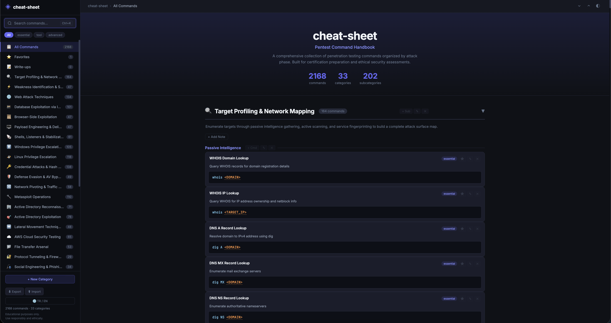
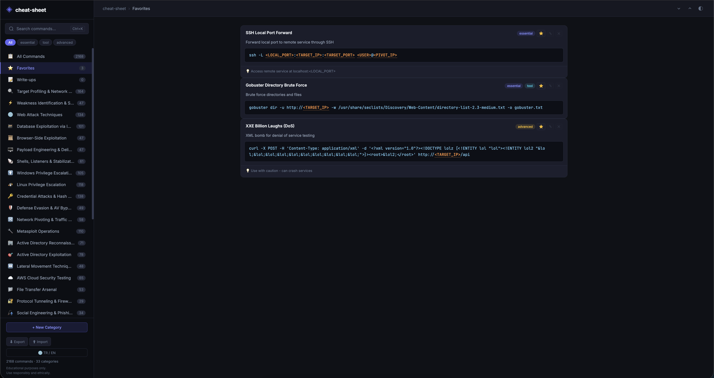
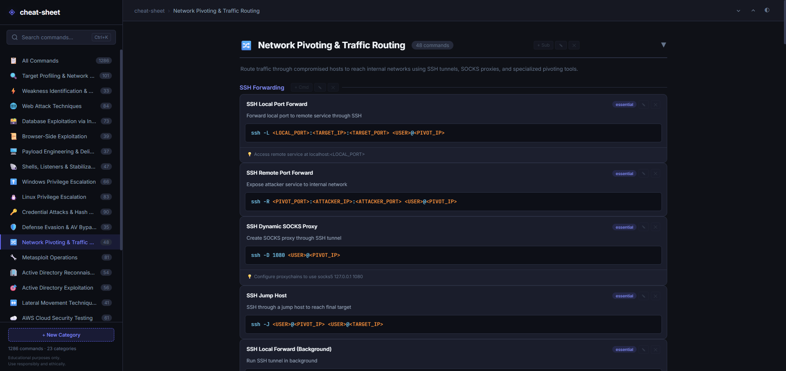
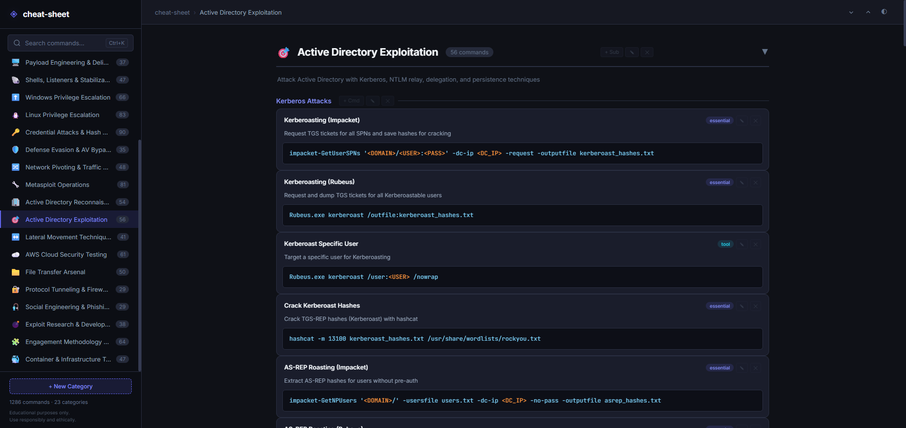

# cheat-sheet

**Offensive Security Command Reference** — A comprehensive, searchable cheat sheet for penetration testing and security certification exams (OSCP, OSWE, OSEP, OSDA , OSWA etc.).


---

## Features

- **1280+ commands** across 23 categories covering the full penetration testing lifecycle
- **Full CRUD** — Add, edit, and delete your own categories, subcategories, and commands
- **Instant search** with `Ctrl+K` keyboard shortcut
- **One-click copy** on every command block
- **Dark / Light theme** toggle with persistent preference
- **Safe placeholders** — All IPs and sensitive values use `<TARGET_IP>`, `<ATTACKER_IP>`, `<DOMAIN>`, etc.
- **Mobile responsive** sidebar navigation
- **Export / Import** your custom command database as JSON
- **Docker ready** — Single command deployment

## Categories

| # | Category | Description |
|---|----------|-------------|
| 1 | Target Profiling & Network Mapping | DNS, OSINT, Nmap, SMB, SNMP, LDAP, HTTP |
| 2 | Weakness Identification & Scanning | Nmap NSE, Nikto, WPScan, Nuclei, SSL |
| 3 | Web Attack Techniques | LFI/RFI, Command Injection, SSRF, XXE, SSTI, Upload |
| 4 | Database Exploitation via Injection | UNION, Blind, Error-based, SQLMap, MSSQL, PostgreSQL |
| 5 | Browser-Side Exploitation | XSS (Reflected/Stored/DOM), CSRF, Filter Bypass |
| 6 | Payload Engineering & Delivery | msfvenom, shellcode, macros, HTA, staged/stageless |
| 7 | Shells, Listeners & Stabilization | Bash, Python, PowerShell, Netcat, Socat, TTY upgrade |
| 8 | Windows Privilege Escalation | WinPEAS, services, tokens, AlwaysInstallElevated |
| 9 | Linux Privilege Escalation | LinPEAS, SUID, sudo, cron, capabilities, Docker escape |
| 10 | Credential Attacks & Hash Cracking | Hydra, Hashcat, John, Mimikatz, spraying, wordlists |
| 11 | Defense Evasion & AV Bypass | AMSI, encoding, AppLocker, CLM, obfuscation |
| 12 | Network Pivoting & Traffic Routing | SSH, Chisel, Ligolo-ng, proxychains, netsh |
| 13 | Metasploit Operations | Modules, Meterpreter, pivoting, auxiliary |
| 14 | Active Directory Reconnaissance | BloodHound, PowerView, SPNs, ACLs, trusts |
| 15 | Active Directory Exploitation | Kerberoast, AS-REP, Golden/Silver Ticket, DCSync |
| 16 | Lateral Movement Techniques | PSExec, WMIExec, Evil-WinRM, RDP, DCOM |
| 17 | AWS Cloud Security Testing | IAM, S3, EC2, IMDS, Pacu, Prowler |
| 18 | File Transfer Arsenal | Python HTTP, PowerShell, certutil, SMB, SCP |
| 19 | Protocol Tunneling & Firewall Evasion | HTTP, DNS, ICMP tunneling, DPI bypass |
| 20 | Social Engineering & Phishing | GoPhish, SET, Evilginx2, SPF/DKIM/DMARC |
| 21 | Exploit Research & Development | SearchSploit, cross-compile, buffer overflow |
| 22 | Engagement Methodology & Playbook | Recon workflow, pivoting, post-exploitation, proofs |
| 23 | Container & Infrastructure Testing | Docker escape, Kubernetes, CI/CD attacks |

## Quick Start

### Docker (Recommended)

```bash
git clone https://github.com/<your-username>/cheat-sheet.git
cd cheat-sheet
docker-compose up -d
```

Open **http://localhost:8899** in your browser.

### Without Docker

```bash
git clone https://github.com/<your-username>/cheat-sheet.git
cd cheat-sheet
npm install
npm start
```

Open **http://localhost:3000** in your browser.

## Usage

### Browsing Commands
- Click any category in the sidebar to filter
- Use `Ctrl+K` to open search, type any keyword
- Click **Copy** on any command block to copy to clipboard
- Toggle dark/light theme with the `◐` button

### Adding Your Own Commands
1. Click **+ New Category** in the sidebar to create a category
2. Click **+ Sub** on a category header to add a subcategory
3. Click **+ Cmd** on a subcategory to add a new command
4. Use `✎` to edit and `✕` to delete any item

### Placeholder Convention

All commands use safe placeholders instead of real IPs:

| Placeholder | Meaning |
|------------|---------|
| `<TARGET_IP>` | Target machine IP |
| `<ATTACKER_IP>` | Your attack machine IP |
| `<DOMAIN>` | Target domain name |
| `<PORT>` | Port number |
| `<USERNAME>` | Username |
| `<PASSWORD>` | Password |
| `<NETWORK>/<CIDR>` | Network range (e.g., 192.168.1.0/24) |
| `<TARGET_URL>` | Full target URL |
| `<DC_IP>` | Domain Controller IP |

## API Endpoints

| Method | Endpoint | Description |
|--------|----------|-------------|
| `GET` | `/api/categories` | List all categories |
| `POST` | `/api/categories` | Create a category |
| `PUT` | `/api/categories/:id` | Update a category |
| `DELETE` | `/api/categories/:id` | Delete a category |
| `POST` | `/api/categories/:id/subcategories` | Add subcategory |
| `POST` | `.../subcategories/:idx/commands` | Add command |
| `PUT` | `.../commands/:cmdIdx` | Update command |
| `DELETE` | `.../commands/:cmdIdx` | Delete command |
| `GET` | `/api/export` | Download full backup (JSON) |
| `POST` | `/api/import` | Import from JSON |
| `POST` | `/api/reset` | Reset to default commands |

## Tech Stack

- **Frontend**: Vanilla HTML/CSS/JS (no framework, no build step)
- **Backend**: Node.js + Express
- **Storage**: JSON file (persisted via Docker volume)
- **Fonts**: Inter + JetBrains Mono (Google Fonts)

## Project Structure

```
cheat-sheet/
├── docker-compose.yml      # Docker orchestration
├── Dockerfile              # Container build
├── package.json            # Node.js dependencies
├── server.js               # Express REST API
├── seed.js                 # Default 240 commands (seed data)
├── public/
│   ├── index.html          # Main HTML
│   ├── style.css           # Dark/Light theme styles
│   └── app.js              # Frontend logic + CRUD
└── data/
    └── commands.json        # Persistent data (auto-generated)
```

## Disclaimer

This tool is intended for **educational purposes only**. All commands and techniques are meant for use in authorized penetration testing, CTF competitions, and security certification preparation. Always ensure you have proper authorization before testing any system.

## License

MIT License — Feel free to use, modify, and distribute.





