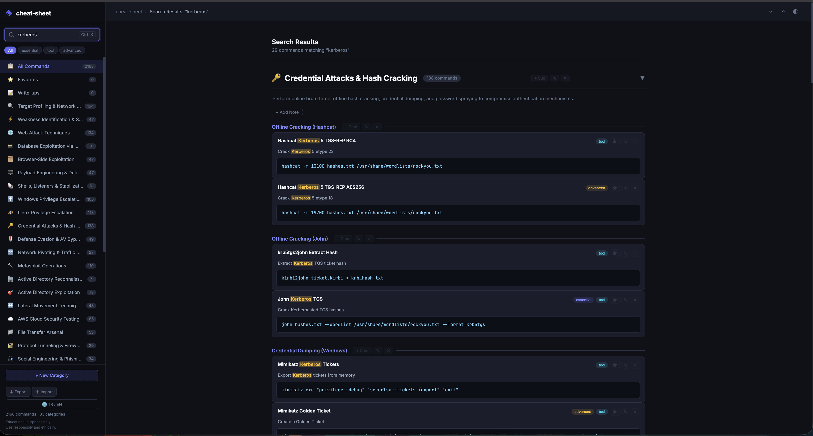
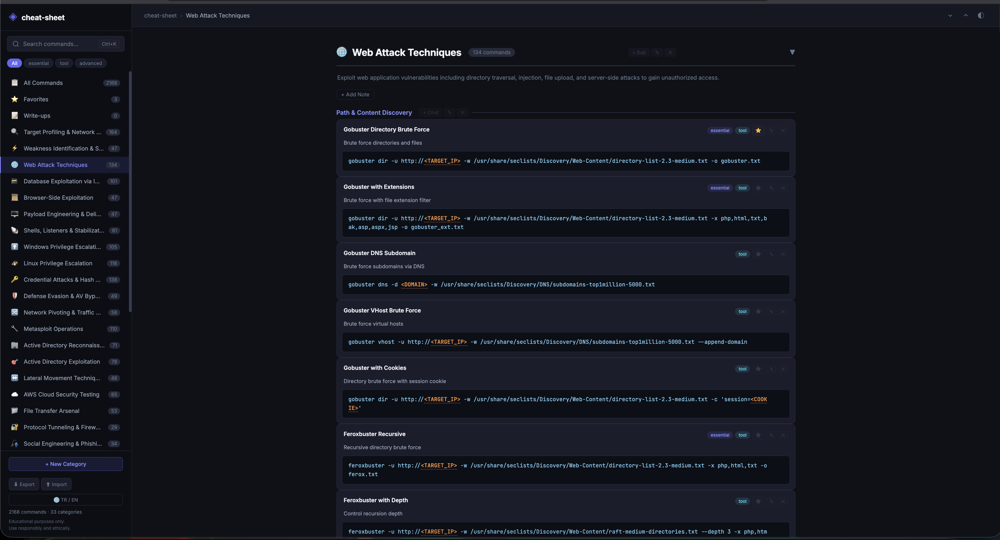
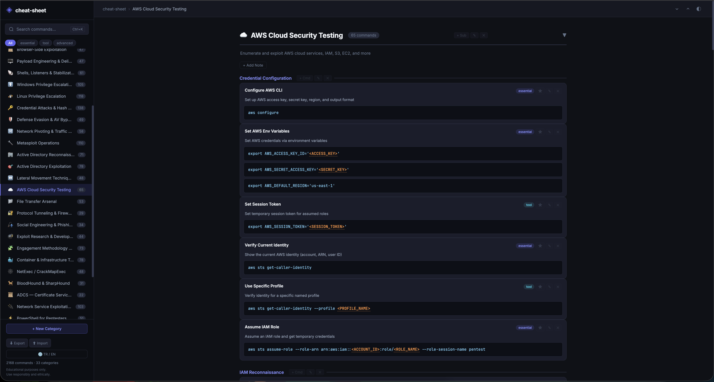
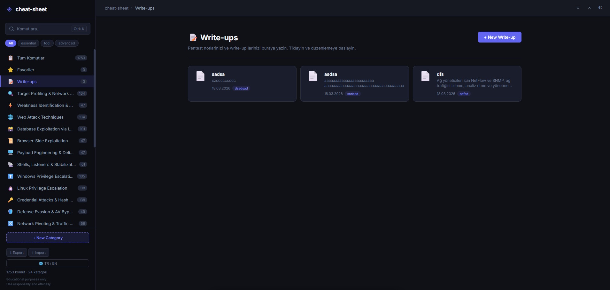
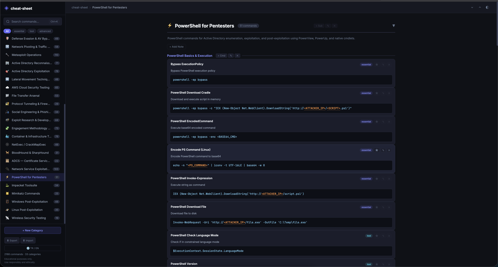

<div align="center">

# 🛡️ Offensive Security & DevSecOps Cheat Sheet

### ▶ **[Try it live — halilibrahimd27.github.io/cheat-sheet](https://halilibrahimd27.github.io/cheat-sheet/)**

*No install, no sign-up. The live build is the full app running in your browser, storing everything in IndexedDB.*

OSCP+ · OSWE · OSEP · OSDA · OSWA · PNPT · CPTS · HTB CPTS  ·  Docker · Kubernetes · Terraform · CI/CD

[](https://github.com/halilibrahimd27/cheat-sheet/stargazers)
[](https://github.com/halilibrahimd27/cheat-sheet/network/members)
[](LICENSE)
[](#docker-recommended)
<!-- STATS:BADGES -->
[](#categories)
[](#categories)
[](#categories)
<!-- /STATS:BADGES -->

> **⭐ If this saved you time, please leave a star.** It's the simplest way to support this work.

</div>

---

> ### ⚖️ Authorised use only
>
> This repository distributes thousands of offensive commands. Run them **only** against
> systems you own or have **explicit written permission** to test — your own lab, CTF and
> HTB/THM boxes, and certification exam targets. Unauthorised access to a computer system
> is a criminal offence in most jurisdictions, and you alone are responsible for what you
> execute. The full scope statement, including what counts as in-scope use and how to
> report a problem, is in **[SECURITY.md](SECURITY.md)**.

---

<!-- STATS:START -->
**5040 commands** across **53 categories** and **320 subcategories**, with **1465 MITRE ATT&CK technique tags** — bilingual interface (English + Türkçe).
<!-- STATS:END -->

## What this actually is

Despite the name, this is not a static cheat sheet. It is a **single-user, local-first
pentest workbench** — the commands are its content layer, not its product.

The loop it is built around:

1. **Set an active target.** Create a box in **Machines** (name, IP, OS, difficulty, platform) and make it the active target.
2. **Work the box.** Every command you copy anywhere in the app is auto-logged to that box's **timeline** with a timestamp — no note-taking discipline required.
3. **Paste your scan.** Drop raw `nmap -sCV` output into the box and it parses into a structured **services table** you can act on.
4. **Bank what you find.** Credentials go into a per-box **vault**, screenshots into **evidence**, progress into an editable **checklist** driven by one of 12 situation-aware playbooks.
5. **Generate the report.** The **Report tab** is assembled from the box's current data — services, creds, timeline, evidence — and exports to Markdown / HTML / PDF, or lands in the **Write-ups** editor for polish.

Everything else — the 5040 commands, the fuzzy palette, the placeholder fill bar, the
script basket — exists to feed step 2 quickly and correctly.

**See it, rather than read about it:** [`examples/`](examples/) holds one fictional lab
box and one OSCP sitting taken all the way round that loop, as a file you can import and
click through. The two reports in there are generated by the same code the app runs, and
the test suite regenerates them on every run so the example cannot quietly go stale.

> **Runs 100% locally.** No account, no telemetry, no cloud, no analytics; the page makes
> no third-party requests. Your data never leaves your machine.
> The only outbound traffic is a link **you** click: MITRE ATT&CK chips open
> `attack.mitre.org`, and 89% of commands carry a reference chip linking to that tool's
> own documentation.

<p align="center">
  
</p>

<p align="center">
  
</p>

<details>
<summary><b>More screenshots</b></summary>

<br>











</details>

> The screenshots above were taken on an earlier build and show a smaller command count
> than the corpus ships today.

## Features

- **Offensive Security + DevSecOps** — full penetration-testing lifecycle *and* container / Kubernetes / IaC / CI-CD security
- **Full CRUD** — Add, edit, and delete your own categories, subcategories, and commands
- **Fuzzy command palette** — `Ctrl+K` opens a ranked search across every command, every category, **and each individual machine & write-up** (search by name / IP / OS / tags), plus jump-to actions (Favorites, Write-ups, Machines, History)
- **One-click copy** on every command block; multi-line commands copy as a single chained script
- **Command history** — every copied command is logged locally with a timestamp, for reporting and quick re-copy
- **Dark / Light theme** — follows your OS preference, with a manual toggle
- **Safe placeholders** — All IPs and sensitive values use `<TARGET_IP>`, `<ATTACKER_IP>`, `<DOMAIN>`, etc.
- **Variable Fill Bar** + **Quick IP Changer** with **saved profiles** — fill `<PLACEHOLDER>` values once and auto-apply them to every command; save a named profile per target box and switch instantly
- **Multi-select tag filter** by `essential` / `tool` / `advanced` (chips combine), plus **Favorites** (id-stable, survive reordering)
- **MITRE ATT&CK tags** — **1,164 offensive commands carry 1,477 technique tags across 72 distinct ATT&CK techniques** (every id verified against attack.mitre.org), shown as chips that link to the technique page, with a single **ATT&CK filter chip** that narrows the view to commands carrying a technique tag. There is deliberately **no per-technique facet** — one filter row, one decision. The mapping is generated by a curated, idempotent tagger (`npm run tag:attack`) that only tags offensive commands; DevSecOps / ops / detection commands stay untagged
- **Reference links** — **4,487 of the 5,040 commands (89%) carry a reference chip** to the tool's own documentation: 4,488 links across 104 hosts, every one of them fetched and confirmed to answer 200 before it shipped. The link is the vendor's or the project's own page — never a blog, a shortener or an SEO aggregator — and a forge link labels itself with the project rather than with "github.com". The rest are code snippets (`import`, `<?php`, prose) where no honest single source exists; `node scripts/validate-content.js` ratchets that gap so it can shrink but never grow
- **Script basket** — collect commands from anywhere into an ordered scratch buffer, reorder them, then **copy or export as one runnable `.sh` script** (placeholders resolved)
- **Machines** — a full box-solving workspace: **12 situation-aware playbooks** plus rich metadata (**platform · difficulty · status · tags**), **user/root flag capture**, **time-to-own tracking**, a **dashboard** (aggregate stats + search/filter/sort) with a **Kanban board** view (drag cards between status columns), a **structured services table** with **one-click nmap import** (paste `-sCV` output → parsed rows) and quick-scan chips, a **credential vault** (structured, per-secret copy, validity toggle — see the [plaintext-storage note](#the-credential-vault-is-stored-in-plaintext)), an **activity timeline** that auto-logs every command you copy while a box is the **active target**, **evidence** (paste/drop screenshots), an **editable checklist**, per-phase **"copy all"**, a live **Report tab** built from the machine's current data (export MD/HTML/PDF or save to Write-ups), and an **AD engagement mode** (attach hosts, draggable node-link schematic with progress rings, per-host checklists/loot/notes)
- **Sessions** — a preset-driven wrapper around one piece of work, from first scan to finished report (`#session`, or `g e`): **16 presets** in two shapes — target-based (Quick Lab, CTF, OSCP/OSCP+, OSWE, OSWA, OSEP, PNPT, HTB CPTS, custom) and task-based (CKS, CKA, CKAD, DCA, Terraform Associate, cloud-native lab) — carrying **965 methodology steps**, **219 service-enumeration commands across 38 services** and **319 "I'm stuck" hints**. The preset decides what exists: Quick Lab shows no timer and no score, OSCP+ gets the clock, the live score and the **cheapest remaining route to the pass mark**, CKA/CKS get per-task budgets and a cluster-context gate. Every rule is labelled **official** or **inferred**, numbers the vendor does not publish are shown as undisclosed, and tool restrictions are **advisory — they never block**. It reuses the Machines services table, vault, timeline and evidence rather than forking them, and its ~594 KB corpus is fetched **on demand**, never on first paint (see [Sessions](#sessions))
- **Write-ups** — split live-preview Markdown editor with a formatting toolbar, an offline **CVSS 3.1 base-score calculator** (insert score/severity/vector), **8 professional report templates** and **13 insertable sections** (findings table, CVSS scale, attack narrative, ATT&CK map, remediation matrix, tooling, timeline, scope/RoE, evidence, references…), rich Markdown (nested lists, strikethrough, autolinked URLs, per-block code copy), tables, task lists, auto TOC, reading time, list **search / tag-filter / sort / pin**, a **linked machine** that auto-fills target placeholders, image upload (paste & drag-and-drop) and **MD / HTML / PDF export** — both HTML **and Markdown** are fully self-contained (images inlined as data URIs)
- **Notes** — per-category sticky notes
- **Deep links & PWA** — bookmarkable views (`#machines`, `#cat/<id>`), installable, works offline
- **Runs with or without a server** — the full app also builds to a **static, server-less bundle** (`npm run build:static`) backed by an in-browser **IndexedDB** store, ready to publish on **GitHub Pages** (see [Static build](#static-build-github-pages--no-server))
- **Export / Import** your database as JSON; a **content validator** keeps the seed data structurally sound (wired into CI)
- **Self-hosted assets** — no web fonts, no CDNs, no third-party scripts; the page renders identically on an air-gapped or VPN-only exam VM
- **Mobile responsive** sidebar navigation, with a **skip link**, a **focus trap that restores focus** on dialog close, `aria-live` announcements, `prefers-reduced-motion` honoured in **both CSS and JS**, and text/control contrast tuned in **both themes**
- **TR / EN** bilingual interface
- **Docker ready & hardened** — single-command deploy, runs **non-root** with a **healthcheck**, binds to `127.0.0.1`, optional HTTP Basic Auth, magic-byte-validated uploads

<!-- EXAM-MODE:START -->
## Sessions

**Sessions** wraps one piece of work — a lab box, a CTF, a certification attempt — from the first
scan to the finished report. Open it at `#session` (`#sessions` and `#exam` also resolve), or press
`g` then `e`. A **preset decides what the screen shows**, so the same view serves someone solving a
box on a weeknight and someone sitting a 24-hour exam.

**16 presets, in two shapes** ([`public/session-data.js`](public/session-data.js)):

- **Target-based** — `quick-lab`, `ctf`, `oscp`, `oscp-plus`, `oswe`, `oswa`, `osep`, `pnpt`,
  `htb-cpts`, `custom`. The unit of work is a machine and a flag.
- **Task-based** — `cks`, `cka`, `ckad`, `dca`, `terraform-associate`, `cloud-native-lab`. The unit
  of work is a discrete task in a proctored terminal, scored by weighted curriculum domain
  (36 domains in total).

Behind them: **965 methodology steps** across 114 phases, **219 service-enumeration commands**
covering **38 services** (ftp → x11), and **319 "I'm stuck" hints** filed by focus and phase.

**It adapts, and that is the point.** Every piece of cockpit furniture is gated on a preset field
rather than a setting:

- **Quick Lab** has no timer, no score and no ceremony (`durationMin: 0`, no points) — solving one
  box on a weeknight should not open an exam cockpit.
- **OSCP+** gets the clock (23h45 + a 24h report window), the live score against the published
  100-point layout, and the **cheapest remaining route to 70** — an exact knapsack over the flags
  you have not captured yet, so you can see which combination is the shortest way to the pass mark.
- **OSWE** gets a whitebox flow (47h45, 85 to pass) built around source review and a working exploit
  chain rather than box-hopping.
- **CKA / CKS / CKAD** get a **per-task time budget** derived from the exam's 2 hours minus a review
  reserve, and a **context-confirmation step** — a task's timer will not start until you confirm the
  `kubectl` context, because working in the wrong cluster is the most common avoidable failure on
  those exams.

**Honesty is a feature.**

- All **158 ground rules carry provenance** — 148 `official` (the vendor published it) and 10
  `inferred` (someone concluded it) — and the two render differently.
- Where a vendor does not publish a number, the app says so instead of inventing one: **OSWE's point
  split**, **DCA's pass mark** and **Terraform's domain weights** (a derived study allocation,
  labelled as such) are all rendered as undisclosed.
- **Tool restrictions are advisory and never block.** A warning that fires on a permitted tool
  teaches people to ignore warnings, and then the one that mattered gets ignored too.
- Each preset ships a **"What was not verified" list** (72 entries) and **links its sources**
  (89 links). Exam formats change: treat this as a study aid and **confirm anything load-bearing
  against your own current exam guide**.

**It reuses the Machines workspace instead of forking it.** Link a target to a machine and the
enumeration queue builds itself from that machine's **services table** (so an `nmap -sCV` import
feeds it), commands you copy land in the machine's **timeline**, and the **credential vault** and
**evidence** you already have are what the report is assembled from.

**Zero first-paint cost.** `session-data.js` is ~594 KB and is fetched **on demand** the first time
you open Sessions — never on load — and is precached by the service worker, so it works offline
afterwards and in the static GitHub Pages build. State is one JSON document (`GET`/`PUT /api/exam`,
or IndexedDB in the server-less build), so it exports and imports with the rest of your data.

<!-- EXAM-MODE:END -->

## Categories

<!-- CATEGORIES:START -->
<!-- This table is generated from seed.js by scripts/update-readme.js — do not edit by hand. -->
| # | Category | Commands | Description |
|---|----------|----------|-------------|
| 1 | 🔍 Target Profiling & Network Mapping | 171 | Enumerate targets through passive intelligence gathering, active scanning, and service… |
| 2 | ⚡ Weakness Identification & Scanning | 47 | Identify known vulnerabilities and misconfigurations across network services and web ap… |
| 3 | 🌐 Web Attack Techniques | 136 | Exploit web application vulnerabilities including directory traversal, injection, file… |
| 4 | 🗃️ Database Exploitation via Injection | 101 | Detect and exploit SQL injection vulnerabilities to extract data, escalate privileges,… |
| 5 | 📜 Browser-Side Exploitation | 47 | Exploit cross-site scripting, cross-site request forgery, and DOM-based vulnerabilities… |
| 6 | 🖥️ Payload Engineering & Delivery | 47 | Generate reverse shells, bind shells, web shells, and custom payloads for various platf… |
| 7 | 🐚 Shells, Listeners & Stabilization | 61 | Establish reverse shells, bind shells, and web shells across platforms, then upgrade to… |
| 8 | ⬆️ Windows Privilege Escalation | 105 | Escalate privileges on Windows hosts through service misconfigurations, token abuse, cr… |
| 9 | 🐧 Linux Privilege Escalation | 121 | Escalate privileges on Linux systems through SUID binaries, sudo misconfigurations, cap… |
| 10 | 🔑 Credential Attacks & Hash Cracking | 146 | Perform online brute force, offline hash cracking, credential dumping, and password spr… |
| 11 | 🛡️ Defense Evasion & AV Bypass | 49 | Bypass antivirus, AMSI, AppLocker, Constrained Language Mode, and other security contro… |
| 12 | 🔀 Network Pivoting & Traffic Routing | 69 | Route traffic through compromised hosts to reach internal networks using SSH tunnels, S… |
| 13 | 🔧 Metasploit Operations | 110 | Metasploit Framework for exploitation, post-exploitation, and pivoting |
| 14 | 🏢 Active Directory Reconnaissance | 71 | Enumerate Active Directory domains, users, groups, trusts, and attack paths |
| 15 | 🎯 Active Directory Exploitation | 78 | Attack Active Directory with Kerberos, NTLM relay, delegation, and persistence techniques |
| 16 | ↔️ Lateral Movement Techniques | 48 | Move laterally across the network using remote execution and Windows protocols |
| 17 | ☁️ AWS Cloud Security Testing | 65 | Enumerate and exploit AWS cloud services, IAM, S3, EC2, and more |
| 18 | 📁 File Transfer Arsenal | 53 | Techniques for transferring files to and from targets across different protocols |
| 19 | 🔐 Protocol Tunneling & Firewall Evasion | 29 | Bypass firewalls and deep packet inspection using protocol tunneling techniques |
| 20 | 🎣 Social Engineering & Phishing | 34 | Phishing infrastructure, credential harvesting, and social engineering tools |
| 21 | 💣 Exploit Research & Development | 44 | Find, adapt, compile, and develop exploits for penetration testing |
| 22 | 🧩 Engagement Methodology & Playbook | 73 | Structured pentest workflow, service checklists, and engagement methodology |
| 23 | 🐳 Container & Infrastructure Testing | 78 | Test Docker, Kubernetes, and CI/CD pipeline security |
| 24 | 🕸️ NetExec / CrackMapExec | 80 | NetExec (nxc) and CrackMapExec for Active Directory enumeration, lateral movement, and… |
| 25 | 🐕 BloodHound & SharpHound | 39 | BloodHound AD attack path analysis, SharpHound collection, and useful Cypher queries fo… |
| 26 | 📜 ADCS — Certificate Services Attacks | 22 | Active Directory Certificate Services exploitation — ESC1 through ESC8 using Certipy, C… |
| 27 | 🔌 Network Service Exploitation | 127 | Service-specific exploitation techniques for common ports found during OSCP-style engag… |
| 28 | ⚡ PowerShell for Pentesters | 51 | PowerShell commands for Active Directory enumeration, exploitation, and post-exploitati… |
| 29 | 🐍 Impacket Toolsuite | 34 | Comprehensive Impacket tools for Windows/AD protocol attacks, credential dumping, and l… |
| 30 | 🐱 Mimikatz Commands | 25 | Mimikatz credential extraction, Kerberos ticket manipulation, and Windows credential at… |
| 31 | 🪟 Windows Post-Exploitation | 55 | Windows post-exploitation — situational awareness, persistence, data gathering, and pri… |
| 32 | 🐧 Linux Post-Exploitation | 35 | Linux post-exploitation — situational awareness, credential hunting, persistence, and l… |
| 33 | 📡 Wireless Security Testing | 19 | WiFi security testing — WPA/WPA2 cracking, WPS attacks, evil twin, and wireless reconna… |
| 34 | 🔶 Burp Suite | 41 | Burp Suite web application security testing — proxy setup, scanning, intruder attacks,… |
| 35 | 💉 MSFVenom Payload Reference | 28 | Comprehensive msfvenom payload generation for various platforms, formats, and encoders. |
| 36 | 🐳 Docker — Engine & CLI | 224 | Day-to-day Docker operations: image build/manage, container lifecycle, volumes, network… |
| 37 | 🛡️ Docker Security | 220 | Securing Docker: image scanning, Dockerfile hardening, runtime security, secrets, rootl… |
| 38 | ☸️ Kubernetes — kubectl Operations | 222 | Operating Kubernetes with kubectl: workloads, services, config, debugging, contexts, an… |
| 39 | 🔐 Kubernetes Security | 215 | Securing and attacking Kubernetes: RBAC, Pod Security, network policies, admission cont… |
| 40 | 🏗️ Terraform / IaC Core | 190 | Terraform workflow: init, plan, apply, state management, workspaces, modules, providers… |
| 41 | 🔎 IaC Security Scanning | 190 | Static analysis and policy enforcement for infrastructure-as-code: Terraform, CloudForm… |
| 42 | ⚙️ Ansible Automation | 189 | Ansible for configuration management and automation: ad-hoc commands, playbooks, invent… |
| 43 | 🔁 CI/CD Pipeline Security | 192 | Securing CI/CD pipelines: GitHub Actions / GitLab CI hardening, secrets scanning, SAST/… |
| 44 | ⛓️ Software Supply Chain Security | 136 | Supply chain integrity: SBOM generation, artifact signing, provenance/attestation, and… |
| 45 | 🗝️ Secrets Management | 139 | Managing and protecting secrets: HashiCorp Vault, SOPS, sealed-secrets, cloud secret ma… |
| 46 | 🦅 Cloud-Native Runtime Security | 137 | Runtime threat detection and enforcement for containers and hosts using eBPF-based and… |
| 47 | 🌩️ Cloud Security Posture (Multi-Cloud) | 197 | Auditing cloud posture across AWS, Azure, and GCP with CSPM and IAM tooling. |
| 48 | ⎈ Helm & Package Management | 110 | Helm chart operations and security: install, upgrade, templating, repositories, and cha… |
| 49 | 🔗 Service Mesh & Network Security | 108 | Service mesh operations and zero-trust networking: Istio, Linkerd, Cilium, and mTLS. |
| 50 | 📊 Observability & Detection Engineering | 136 | Security observability and detection: log pipelines, SIEM queries, and detection-as-cod… |
| 51 | 📱 Mobile Application Security | 40 | Android and iOS application security testing: static reversing, dynamic instrumentation… |
| 52 | 🤖 LLM / AI Security | 32 | Testing LLM-powered applications: prompt injection and jailbreaks, automated red-team s… |
| 53 | 🟣 Purple Team & Detection Validation | 24 | Adversary emulation and detection validation: Atomic Red Team, MITRE Caldera, ATT&CK ma… |
<!-- CATEGORIES:END -->

## Quick Start

### Docker (Recommended)

```bash
git clone https://github.com/halilibrahimd27/cheat-sheet.git
cd cheat-sheet
docker compose up -d
```

Open **http://localhost:8899** in your browser.

> The container publishes only to `127.0.0.1:8899` by default and persists data in a Docker volume — your custom commands survive restarts and updates.

### Without Docker

```bash
git clone https://github.com/halilibrahimd27/cheat-sheet.git
cd cheat-sheet
npm install
npm start
```

Open **http://localhost:3000** in your browser.

> By default the server binds to `127.0.0.1` (localhost only). See [Configuration](#configuration) to expose it on your network safely.

### Static build (GitHub Pages — no server)

The whole app can run with **no backend at all**: an in-browser adapter
([`public/local-backend.js`](public/local-backend.js)) mirrors the REST API against
**IndexedDB**, so your data still persists locally in the browser. This is what makes
it publishable to GitHub Pages — and it is what the [live demo](https://halilibrahimd27.github.io/cheat-sheet/) runs.

```bash
npm run build:static     # emits a self-contained ./docs folder
```

Commit the regenerated `docs/` and push to `main`. This repo ships
[`.github/workflows/deploy-pages.yml`](.github/workflows/deploy-pages.yml), which rebuilds
`docs/` from the commit being deployed, uploads it as a Pages artifact and publishes it —
so in your fork set **Settings → Pages → Source: GitHub Actions** (not "Deploy from a
branch"). It runs on any push to `main` that touches `docs/**`, `public/**`, `seed.js` or
the build script, and can also be started by hand from the **Actions** tab
(`workflow_dispatch`). CI separately fails if the committed `docs/` has drifted from
`public/` + `seed.js`.

Your cheat sheet is then live at `https://<user>.github.io/<repo>/`.

> The static build bundles the seed into `docs/seed-data.js`, uses relative paths (works
> under a project subpath), and stores everything (categories, notes, write-ups, machines,
> uploaded screenshots as inline data URIs) in IndexedDB. Export/Import still work. Re-run
> `npm run build:static` after changing `seed.js` or the frontend.

### Update to Latest Commands

Pulling new code does **not** touch your database — your data lives in `data/` (or in a
Docker volume), and the seed is only used the first time the app starts. To merge newly
shipped commands into an existing database, use the update endpoint.

First, see where you stand:

```bash
curl -s http://localhost:8899/api/seed-status
```

Then preview the merge before it happens (a dry run writes nothing):

```bash
curl -s -X POST 'http://localhost:8899/api/update?dryRun=1'
```

If the preview looks right, apply it:

```bash
curl -s -X POST http://localhost:8899/api/update
```

`POST /api/update` is **non-destructive**: it adds categories, subcategories and commands
that are new in the seed and leaves your own edits, additions and deletions alone.

**Docker:** the image bakes `seed.js` in at build time, so `git pull` alone is not enough —
you have to rebuild the image before the new commands exist inside the container:

```bash
git pull
docker compose up -d --build                                   # rebuild with the new seed
curl -s -X POST 'http://127.0.0.1:8899/api/update?dryRun=1'   # preview
curl -s -X POST http://127.0.0.1:8899/api/update               # apply
```

Your `cheat-sheet-data` volume is untouched by the rebuild.

> `POST /api/reset` also exists and restores the pristine seed — it **discards everything
> you have added or changed**. Prefer `/api/update`. If you do reset, export a backup
> first via the ⬇ Export button.

## Configuration

All configuration is via environment variables (a `.env` is **not** auto-loaded — pass them inline or via your process manager / Docker):

| Variable | Default | Description |
|----------|---------|-------------|
| `PORT` | `3000` | Port to listen on |
| `HOST` | `127.0.0.1` | Bind address. Set to `0.0.0.0` to expose on your network (the Docker image does this; the port mapping is the boundary there). |
| `DATA_DIR` | `./data` | Where the JSON database, notes, write-ups, machines and uploads are written. Point it at a volume or another disk to relocate your data; the test suite uses it to run against a throwaway directory. |
| `AUTH_USER` | `admin` | Basic Auth username (only used when `AUTH_PASS` is set) |
| `AUTH_PASS` | *(unset)* | When set, **all** requests require HTTP Basic Auth. The browser prompts once and the SPA keeps working. |
| `ALLOWED_HOSTS` | *(unset)* | Extra `Host` header values to accept. The DNS-rebinding guard is **always on** and already accepts the loopback names and any bare IP literal, so a local run or a LAN IP needs nothing here. Set it when the app is reached by a *name* — a machine hostname, or a reverse proxy's domain. Any other `Host` gets `403`. |
| `JSON_LIMIT` | `12mb` | Max request body size (covers image uploads + full DB import) |

See [`.env.example`](.env.example) for a copy-paste template.

## Security

This is a **local-first, single-user** tool. Defaults are chosen so it is safe out of the box:

- **Binds to `127.0.0.1`** — not reachable from your network unless you explicitly set `HOST=0.0.0.0`.
- **Optional HTTP Basic Auth** — set `AUTH_PASS` (and optionally `AUTH_USER`) before exposing it anywhere beyond localhost. If you bind to `0.0.0.0` without a password, the server logs a warning.
- **Hardened uploads** — image uploads are validated by **magic bytes** (not the filename), capped at 5 MB, served with `X-Content-Type-Options: nosniff` and a restrictive CSP. SVG is rejected (it can carry script).
- **Escaping at render, validation at the boundary, CSP as backstop** — user-supplied text (category and command names, tags, machine fields, write-up metadata) is HTML-escaped or written via `textContent` when it is rendered; `/api/import` structurally validates a payload before it touches your data; and the app ships a **Content-Security-Policy** with `script-src 'self'` — no inline scripts, no CDNs — so an escaping bug that slips through has no easy path to executing script. Markdown rendering in write-ups is the widest remaining surface and the first place to look if you find a problem.
- **Atomic writes** — JSON files are written to a temp file, `fsync`'d, then renamed over the target, with a `.bak` fallback, so a crash or power loss mid-write can't corrupt or truncate your database.
- **Validated import** — `/api/import` rejects malformed payloads before touching your data.
- **No third-party requests** — the app loads no web fonts, CDNs, analytics or telemetry. Outbound traffic only happens when you click an ATT&CK chip or a command's reference link.

### The credential vault is stored in plaintext

The per-machine credential vault is a convenience feature, **not a password manager**.
Secrets you put in it are stored **unencrypted**:

- **Server build:** as plain JSON in `DATA_DIR/machines.json` on disk.
- **Static / GitHub Pages build:** as plain records in the browser's **IndexedDB**, readable by anything with access to that browser profile.
- **Exports:** `GET /api/export` and the ⬇ Export button include every vault entry **verbatim** in the backup JSON, and so does a machine's generated report.

What that means in practice:

- On a **shared or multi-user machine**, anyone who can read your home directory, your Docker volume or your browser profile can read the vault. Treat it as you would a text file of passwords.
- On a **published GitHub Pages origin**, the data itself stays in each visitor's own browser — nothing is uploaded anywhere — but it lives on a public origin, so any XSS on that origin, any other page you install there, or anyone with access to that machine can read it.
- **Never commit an export**, and never paste one into an issue or a write-up you publish.

Use it for lab, CTF and exam boxes. For real engagements, keep credentials in your team's actual secret store.

> Even with auth, treat `/api/reset` and `/api/import` with care — they overwrite data. Keep backups (⬇ Export).

## Usage

### Browsing Commands
- Click any category in the sidebar to filter
- Use `Ctrl+K` to open search, type any keyword
- Click **Copy** on any command block to copy to clipboard
- Toggle dark/light theme with the `◐` button

### Keyboard Shortcuts
`Ctrl+K` command palette · `Ctrl+I` Quick IP Changer · `?` shortcuts · `j`/`k` navigate · `Enter` copy focused · `g h/f/w/m/e` go Home/Favorites/Write-ups/Machines/Sessions · in the write-up editor `Ctrl+B`/`Ctrl+I`/`Ctrl+K` = bold/italic/link

### Adding Your Own Commands
1. Click **+ New Category** in the sidebar to create a category
2. Click **+ Sub** on a category header to add a subcategory
3. Click **+ Cmd** on a subcategory to add a new command
4. Use `✎` to edit and `✕` to delete any item

### Placeholder Convention

All commands use safe placeholders instead of real IPs:

| Placeholder | Meaning |
|------------|---------|
| `<TARGET_IP>` | Target machine IP |
| `<ATTACKER_IP>` / `<LHOST>` | Your attack machine IP |
| `<DOMAIN>` | Target domain name |
| `<PORT>` / `<LPORT>` | Port number |
| `<USERNAME>` / `<USER>` | Username |
| `<PASSWORD>` / `<PASS>` | Password |
| `<NETWORK>/<CIDR>` | Network range (e.g., 192.168.1.0/24) |
| `<TARGET_URL>` | Full target URL |
| `<DC_IP>` | Domain Controller IP |

## API Endpoints

| Method | Endpoint | Description |
|--------|----------|-------------|
| `GET` | `/api/health` | Liveness probe (used by the Docker HEALTHCHECK) |
| `GET` | `/api/categories` | List all categories |
| `POST` | `/api/categories` | Create a category |
| `POST` | `/api/categories/reorder` | Reorder categories by id list |
| `PUT` | `/api/categories/:id` | Update a category |
| `DELETE` | `/api/categories/:id` | Delete a category |
| `POST` | `/api/categories/:id/subcategories` | Add subcategory |
| `PUT` | `/api/categories/:id/subcategories/:subIdx` | Update subcategory |
| `DELETE` | `/api/categories/:id/subcategories/:subIdx` | Delete subcategory |
| `POST` | `.../subcategories/:subIdx/commands` | Add command |
| `PUT` | `.../commands/:cmdIdx` | Update command |
| `DELETE` | `.../commands/:cmdIdx` | Delete command |
| `GET` | `/api/notes` | All per-category notes, keyed by category id |
| `GET` | `/api/notes/:catId` | Notes for one category |
| `POST`/`PUT`/`DELETE` | `/api/notes/:catId/:noteId?` | Create / update / delete a note |
| `GET` | `/api/writeups` | List write-ups |
| `POST`/`PUT`/`DELETE` | `/api/writeups/:id?` | Create / update / delete a write-up |
| `GET` | `/api/machines` | List machines |
| `POST`/`PUT`/`DELETE` | `/api/machines/:id?` | Create / update / delete a machine |
| `POST` | `/api/upload` | Upload a write-up image (base64, magic-byte validated) |
| `GET` | `/api/export` | Download full backup (JSON) |
| `POST` | `/api/import` | Import from JSON (validated) |
| `GET` | `/api/seed-status` | Whether the bundled seed is newer than the one your database was built from |
| `POST` | `/api/update` | Non-destructive merge of new seed content; `?dryRun=1` previews without writing |
| `POST` | `/api/reset` | **Destructive** — restore the pristine seed, discarding your changes |
| `GET`/`PUT` | `/api/exam` | Read / replace the Sessions state document (one JSON object) — see [Sessions](#sessions) |

## Tech Stack

- **Frontend**: Vanilla HTML/CSS/JS (no framework, no build step)
- **Backend**: Node.js + Express (single runtime dependency)
- **Storage**: JSON files (atomic writes, persisted via Docker volume); IndexedDB in the static build
- **Fonts**: system font stacks — nothing is fetched from the network

## Project Structure

```
cheat-sheet/
├── server.js               # Express REST API (exports app; testable)
├── seed.js                 # Default commands (seed data)
├── package.json            # Scripts + the single runtime dependency
├── eslint.config.js        # Flat ESLint config (npm run lint)
├── Dockerfile              # Container build (non-root, healthcheck)
├── docker-compose.yml      # Docker orchestration
├── .env.example            # Configuration template
├── .dockerignore
├── .gitattributes          # Line-ending normalisation (keeps the static build reproducible)
├── LICENSE                 # MIT
├── README.md
├── CONTRIBUTING.md         # How to add commands and how to work on the app
├── CODE_OF_CONDUCT.md
├── SECURITY.md             # Scope statement + vulnerability reporting
├── .github/
│   ├── workflows/
│   │   ├── ci.yml              # Lint, test, content + dependency audit, README/docs drift gates
│   │   ├── codeql.yml          # CodeQL static analysis
│   │   └── deploy-pages.yml    # Rebuild docs/ and publish it to GitHub Pages
│   ├── ISSUE_TEMPLATE/         # Bug, correction, command, feature, workspace/Exam Mode
│   ├── PULL_REQUEST_TEMPLATE.md
│   ├── dependabot.yml
│   ├── CODEOWNERS
│   └── FUNDING.yml
├── scripts/
│   ├── update-readme.js    # Regenerate stats + category table from seed.js
│   ├── validate-content.js # Seed structure/quality validator (runs in CI)
│   ├── build-static.js     # Emit ./docs — a server-less build for GitHub Pages
│   ├── tag-attack.js       # Map offensive commands → MITRE ATT&CK ids (idempotent)
│   ├── merge-category.js   # Merge a category JSON into seed.js
│   ├── fix-translations.js # One-off: fill in missing Turkish descriptions
│   ├── fix-turklish.js     # One-off: repair botched auto-translated desc_tr strings
│   └── turklish-detect.js  # Shared garbled-Turkish detector (used by the content validator)
├── test/                   # node:test suites (no test framework)
│   ├── session.test.js     # Sessions: preset data integrity + view rendering
│   ├── icons.test.js       # The sprite: every icon reference resolves, no glyph creeps back
│   ├── references.test.js  # Command reference links: https-only, real docs, coverage ratchet
│   ├── nav-badge.test.js   # The sidebar badge contract app.js calls into
│   ├── examples.test.js    # Regenerates examples/ and fails if it drifted
│   ├── touch-targets.test.js  # Every icon-only control is at least 24x24 (WCAG 2.5.8)
│   ├── scripts.test.js     # validate-content / fix-turklish / build-static, run as processes
│   └── helpers/            # DOM/IndexedDB/server harnesses shared by the suites
├── public/
│   ├── index.html          # Main HTML (CSP meta, no inline script)
│   ├── style.css           # Dark/Light theme styles
│   ├── app.js              # Frontend logic + CRUD
│   ├── session.js          # Sessions view (optional script; app.js works without it)
│   ├── session-data.js     # Session presets, service probes, stuck-hints (~594 KB, loaded on demand)
│   ├── checklist-templates.js  # Static HTB/THM/OSCP machine playbooks
│   ├── local-backend.js    # In-browser IndexedDB API (static / offline build)
│   ├── sw-register.js      # Service-worker registration (external file, CSP-safe)
│   ├── manifest.json       # PWA manifest
│   └── service-worker.js   # Offline cache (stale-while-revalidate)
├── examples/               # One box solved end to end — importable, and regenerated by the tests
│   ├── oscp-lab.json        # The bundle: the machine + the OSCP session that graded it
│   ├── sentinel-nmap.txt    # The raw scan to paste into Import nmap
│   ├── sentinel-machine.md  # Generated by machineToMarkdown()
│   └── oscp-session-report.md  # Generated by buildReportMarkdown()
├── assets/                 # README screenshots
├── docs/                   # Static build output (npm run build:static) — GitHub Pages
└── data/                   # Persistent data (auto-generated, git-ignored)
```

## Content provenance & attribution

The command corpus was written and curated for this repository from the maintainer's own
lab and certification-prep notes, from official tool documentation and `--help` output,
and from widely published technique knowledge. It is **not** copied from
[HackTricks](https://book.hacktricks.wiki/), PayloadsAllTheThings, or any other
CC BY-NC-SA / share-alike source; where such a resource is genuinely the best explanation
of a technique, it is linked from a command's `ref` field rather than reproduced. If you
believe any entry reproduces third-party material, please
[open an issue](../../issues/new/choose) and it will be rewritten or removed.

Contributions must follow the same rule — see [CONTRIBUTING.md](CONTRIBUTING.md).

### MITRE ATT&CK®

MITRE ATT&CK® is a registered trademark of The MITRE Corporation. This project is **not**
affiliated with, endorsed by, or sponsored by MITRE. Technique identifiers (`T####`) and
technique names are used here only to reference the publicly published
[ATT&CK knowledge base](https://attack.mitre.org/) — © The MITRE Corporation — under the
[ATT&CK Terms of Use](https://attack.mitre.org/resources/legal-and-branding/terms-of-use/).
The command text, descriptions and mappings in this repository are the project's own work
and are licensed under [MIT](LICENSE).

## Disclaimer

This tool is intended for **educational purposes only**. All commands and techniques are
meant for use in authorized penetration testing, CTF competitions, and security
certification preparation. Always ensure you have proper authorization before testing any
system — see [SECURITY.md](SECURITY.md) for the full scope statement.

## Contributing

Contributions are welcome — and not only commands. Bug reports, workspace features,
accessibility fixes, translations and documentation all count. See
[CONTRIBUTING.md](CONTRIBUTING.md). In short:

1. Fork the repository and create a branch (`git checkout -b feat/your-change`)
2. Make your change — for seed content, follow the existing structure and include `desc_tr`
3. Run `npm run lint`, `npm test` and `npm run validate-content`
4. If you touched `seed.js`, run `node scripts/update-readme.js` (CI checks this)
5. Open a pull request

## License

MIT License — Feel free to use, modify, and distribute. See [LICENSE](LICENSE) for full text.

---

<div align="center">

## 🌟 Support this project

| Time | How you can help |
|---|---|
| **5 seconds** | Click the **⭐ Star** button at the top |
| **30 seconds** | Share on Twitter / LinkedIn / your Discord |
| **5 minutes** | Open an [issue](../../issues/new/choose) for a missing command |
| **30 minutes** | Submit a PR with new commands or fixes |
| **2 hours** | Add a whole new category |

**Star history:**

[](https://star-history.com/#halilibrahimd27/cheat-sheet&Date)

</div>
