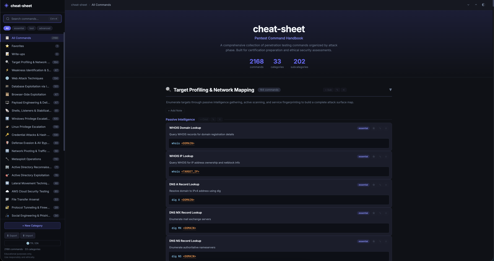
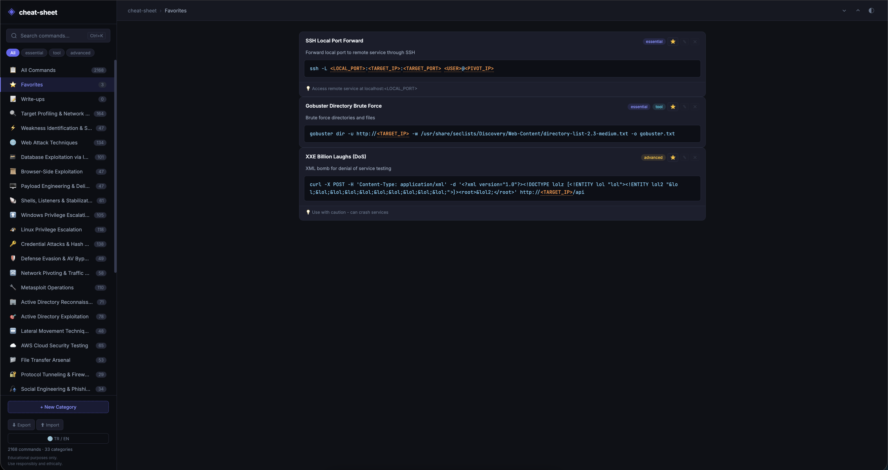
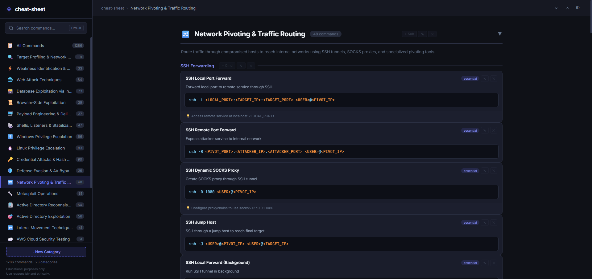
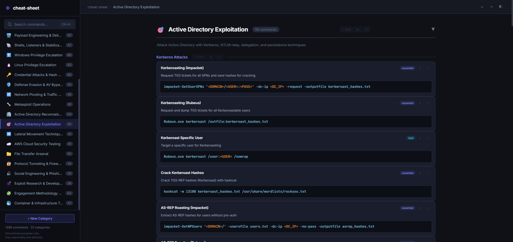
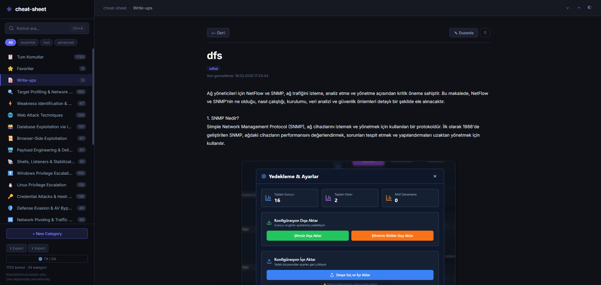

<div align="center">

# 🛡️ Offensive Security & DevSecOps Cheat Sheet

### *Interactive command reference for penetration testing, certification prep & DevSecOps*

OSCP+ · OSWE · OSEP · OSDA · OSWA · PNPT · CPTS · HTB CPTS  ·  Docker · Kubernetes · Terraform · CI/CD

[](https://github.com/halilibrahimd27/cheat-sheet/stargazers)
[](https://github.com/halilibrahimd27/cheat-sheet/network/members)
[](LICENSE)
[](#docker-recommended)
<!-- STATS:BADGES -->
[](#categories)
[](#categories)
<!-- /STATS:BADGES -->

> **⭐ If this saved you time, please leave a star.** It's the simplest way to support this work.

</div>

---

<!-- STATS:START -->
**4256 commands** across **45 categories** and **282 subcategories** — every command bilingual (English + Türkçe).
<!-- STATS:END -->

> Runs **100% locally**. No account, no telemetry, no cloud — your data never leaves your machine.

## Features

- **Offensive Security + DevSecOps** — full penetration-testing lifecycle *and* container / Kubernetes / IaC / CI-CD security
- **Full CRUD** — Add, edit, and delete your own categories, subcategories, and commands
- **Instant search** with `Ctrl+K` keyboard shortcut
- **One-click copy** on every command block
- **Dark / Light theme** toggle with persistent preference
- **Safe placeholders** — All IPs and sensitive values use `<TARGET_IP>`, `<ATTACKER_IP>`, `<DOMAIN>`, etc.
- **Mobile responsive** sidebar navigation
- **Variable Fill Bar** — Fill `<PLACEHOLDER>` values in the UI and auto-copy completed command
- **Quick IP Changer** — Set `LHOST`/`RHOST`/`LPORT`/`DOMAIN`/`USER` once, applied to every command
- **Favorites** — Bookmark frequently used commands (stored in browser)
- **Tag filtering** — Filter by `essential`, `tool`, `advanced`
- **Write-ups** — Built-in Markdown editor for machine write-ups with image upload + MD/PDF export
- **Machines** — Per-target tracker with an OSCP-style 11-step checklist
- **Notes** — Per-category sticky notes
- **Export / Import** your custom command database as JSON
- **TR/EN** bilingual interface and content
- **PWA** — Installable, works offline
- **Docker ready** — Single command deployment
- **Secure by default** — Binds to `127.0.0.1`, optional HTTP Basic Auth, hardened uploads

## Categories

<!-- CATEGORIES:START -->
<!-- This table is generated from seed.js by scripts/update-readme.js — do not edit by hand. -->
| # | Category | Commands | Description |
|---|----------|----------|-------------|
| 1 | 🔍 Target Profiling & Network Mapping | 171 | Enumerate targets through passive intelligence gathering, active scanning, and service… |
| 2 | ⚡ Weakness Identification & Scanning | 47 | Identify known vulnerabilities and misconfigurations across network services and web ap… |
| 3 | 🌐 Web Attack Techniques | 136 | Exploit web application vulnerabilities including directory traversal, injection, file… |
| 4 | 🗃️ Database Exploitation via Injection | 101 | Detect and exploit SQL injection vulnerabilities to extract data, escalate privileges,… |
| 5 | 📜 Browser-Side Exploitation | 47 | Exploit cross-site scripting, cross-site request forgery, and DOM-based vulnerabilities… |
| 6 | 🖥️ Payload Engineering & Delivery | 47 | Generate reverse shells, bind shells, web shells, and custom payloads for various platf… |
| 7 | 🐚 Shells, Listeners & Stabilization | 61 | Establish reverse shells, bind shells, and web shells across platforms, then upgrade to… |
| 8 | ⬆️ Windows Privilege Escalation | 105 | Escalate privileges on Windows hosts through service misconfigurations, token abuse, cr… |
| 9 | 🐧 Linux Privilege Escalation | 121 | Escalate privileges on Linux systems through SUID binaries, sudo misconfigurations, cap… |
| 10 | 🔑 Credential Attacks & Hash Cracking | 146 | Perform online brute force, offline hash cracking, credential dumping, and password spr… |
| 11 | 🛡️ Defense Evasion & AV Bypass | 49 | Bypass antivirus, AMSI, AppLocker, Constrained Language Mode, and other security contro… |
| 12 | 🔀 Network Pivoting & Traffic Routing | 69 | Route traffic through compromised hosts to reach internal networks using SSH tunnels, S… |
| 13 | 🔧 Metasploit Operations | 110 | Metasploit Framework for exploitation, post-exploitation, and pivoting |
| 14 | 🏢 Active Directory Reconnaissance | 71 | Enumerate Active Directory domains, users, groups, trusts, and attack paths |
| 15 | 🎯 Active Directory Exploitation | 78 | Attack Active Directory with Kerberos, NTLM relay, delegation, and persistence techniques |
| 16 | ↔️ Lateral Movement Techniques | 48 | Move laterally across the network using remote execution and Windows protocols |
| 17 | ☁️ AWS Cloud Security Testing | 65 | Enumerate and exploit AWS cloud services, IAM, S3, EC2, and more |
| 18 | 📁 File Transfer Arsenal | 53 | Techniques for transferring files to and from targets across different protocols |
| 19 | 🔐 Protocol Tunneling & Firewall Evasion | 29 | Bypass firewalls and deep packet inspection using protocol tunneling techniques |
| 20 | 🎣 Social Engineering & Phishing | 34 | Phishing infrastructure, credential harvesting, and social engineering tools |
| 21 | 💣 Exploit Research & Development | 44 | Find, adapt, compile, and develop exploits for penetration testing |
| 22 | 🧩 Engagement Methodology & Playbook | 73 | Structured pentest workflow, service checklists, and engagement methodology |
| 23 | 🐳 Container & Infrastructure Testing | 78 | Test Docker, Kubernetes, and CI/CD pipeline security |
| 24 | 🕸️ NetExec / CrackMapExec | 80 | NetExec (nxc) and CrackMapExec for Active Directory enumeration, lateral movement, and… |
| 25 | 🐕 BloodHound & SharpHound | 39 | BloodHound AD attack path analysis, SharpHound collection, and useful Cypher queries fo… |
| 26 | 📜 ADCS — Certificate Services Attacks | 22 | Active Directory Certificate Services exploitation — ESC1 through ESC8 using Certipy, C… |
| 27 | 🔌 Network Service Exploitation | 127 | Service-specific exploitation techniques for common ports found during OSCP-style engag… |
| 28 | ⚡ PowerShell for Pentesters | 51 | PowerShell commands for Active Directory enumeration, exploitation, and post-exploitati… |
| 29 | 🐍 Impacket Toolsuite | 34 | Comprehensive Impacket tools for Windows/AD protocol attacks, credential dumping, and l… |
| 30 | 🐱 Mimikatz Commands | 25 | Mimikatz credential extraction, Kerberos ticket manipulation, and Windows credential at… |
| 31 | 🪟 Windows Post-Exploitation | 55 | Windows post-exploitation — situational awareness, persistence, data gathering, and pri… |
| 32 | 🐧 Linux Post-Exploitation | 35 | Linux post-exploitation — situational awareness, credential hunting, persistence, and l… |
| 33 | 📡 Wireless Security Testing | 19 | WiFi security testing — WPA/WPA2 cracking, WPS attacks, evil twin, and wireless reconna… |
| 34 | 🔶 Burp Suite | 41 | Burp Suite web application security testing — proxy setup, scanning, intruder attacks,… |
| 35 | 💉 MSFVenom Payload Reference | 28 | Comprehensive msfvenom payload generation for various platforms, formats, and encoders. |
| 36 | 🐳 Docker — Engine & CLI | 224 | Day-to-day Docker operations: image build/manage, container lifecycle, volumes, network… |
| 37 | 🛡️ Docker Security | 220 | Securing Docker: image scanning, Dockerfile hardening, runtime security, secrets, rootl… |
| 38 | ☸️ Kubernetes — kubectl Operations | 222 | Operating Kubernetes with kubectl: workloads, services, config, debugging, contexts, an… |
| 39 | 🔐 Kubernetes Security | 215 | Securing and attacking Kubernetes: RBAC, Pod Security, network policies, admission cont… |
| 40 | 🏗️ Terraform / IaC Core | 190 | Terraform workflow: init, plan, apply, state management, workspaces, modules, providers… |
| 41 | 🔎 IaC Security Scanning | 190 | Static analysis and policy enforcement for infrastructure-as-code: Terraform, CloudForm… |
| 42 | ⚙️ Ansible Automation | 189 | Ansible for configuration management and automation: ad-hoc commands, playbooks, invent… |
| 43 | 🔁 CI/CD Pipeline Security | 192 | Securing CI/CD pipelines: GitHub Actions / GitLab CI hardening, secrets scanning, SAST/… |
| 44 | ⛓️ Software Supply Chain Security | 136 | Supply chain integrity: SBOM generation, artifact signing, provenance/attestation, and… |
| 45 | 🗝️ Secrets Management | 139 | Managing and protecting secrets: HashiCorp Vault, SOPS, sealed-secrets, cloud secret ma… |
<!-- CATEGORIES:END -->

## Quick Start

### Docker (Recommended)

```bash
git clone https://github.com/halilibrahimd27/cheat-sheet.git
cd cheat-sheet
docker compose up -d
```

Open **http://localhost:8899** in your browser.

> The container publishes only to `127.0.0.1:8899` by default and persists data in a Docker volume — your custom commands survive restarts and updates.

### Without Docker

```bash
git clone https://github.com/halilibrahimd27/cheat-sheet.git
cd cheat-sheet
npm install
npm start
```

Open **http://localhost:3000** in your browser.

> By default the server binds to `127.0.0.1` (localhost only). See [Configuration](#configuration) to expose it on your network safely.

### Update to Latest Commands

If you already have the app running and want to pull the latest seed commands:

```bash
git pull
# Then hit the reset endpoint (this will overwrite your custom data!)
curl -X POST http://localhost:8899/api/reset
```

> **Warning:** Reset overwrites your data. Export a backup first via the ⬇ Export button.

## Configuration

All configuration is via environment variables (a `.env` is **not** auto-loaded — pass them inline or via your process manager / Docker):

| Variable | Default | Description |
|----------|---------|-------------|
| `PORT` | `3000` | Port to listen on |
| `HOST` | `127.0.0.1` | Bind address. Set to `0.0.0.0` to expose on your network (the Docker image does this; the port mapping is the boundary there). |
| `AUTH_USER` | `admin` | Basic Auth username (only used when `AUTH_PASS` is set) |
| `AUTH_PASS` | *(unset)* | When set, **all** requests require HTTP Basic Auth. The browser prompts once and the SPA keeps working. |
| `JSON_LIMIT` | `12mb` | Max request body size (covers image uploads + full DB import) |

See [`.env.example`](.env.example) for a copy-paste template.

## Security

This is a **local-first, single-user** tool. Defaults are chosen so it is safe out of the box:

- **Binds to `127.0.0.1`** — not reachable from your network unless you explicitly set `HOST=0.0.0.0`.
- **Optional HTTP Basic Auth** — set `AUTH_PASS` (and optionally `AUTH_USER`) before exposing it anywhere beyond localhost. If you bind to `0.0.0.0` without a password, the server logs a warning.
- **Hardened uploads** — image uploads are validated by **magic bytes** (not the filename), capped at 5 MB, served with `X-Content-Type-Options: nosniff` and a restrictive CSP. SVG is rejected (it can carry script).
- **Output escaping** — all user-supplied text (category/command names, tags, write-ups) is HTML-escaped before rendering.
- **Atomic writes** — JSON files are written via a temp-file + rename with a `.bak` fallback, so a crash mid-write can't corrupt your database.
- **Validated import** — `/api/import` rejects malformed payloads before touching your data.

> Even with auth, treat `/api/reset` and `/api/import` with care — they overwrite data. Keep backups (⬇ Export).

## Usage

### Browsing Commands
- Click any category in the sidebar to filter
- Use `Ctrl+K` to open search, type any keyword
- Click **Copy** on any command block to copy to clipboard
- Toggle dark/light theme with the `◐` button

### Keyboard Shortcuts
`Ctrl+K` search · `Ctrl+I` Quick IP Changer · `?` shortcuts · `j`/`k` navigate · `Enter` copy focused · `g h/f/w/m` go Home/Favorites/Write-ups/Machines

### Adding Your Own Commands
1. Click **+ New Category** in the sidebar to create a category
2. Click **+ Sub** on a category header to add a subcategory
3. Click **+ Cmd** on a subcategory to add a new command
4. Use `✎` to edit and `✕` to delete any item

### Placeholder Convention

All commands use safe placeholders instead of real IPs:

| Placeholder | Meaning |
|------------|---------|
| `<TARGET_IP>` | Target machine IP |
| `<ATTACKER_IP>` / `<LHOST>` | Your attack machine IP |
| `<DOMAIN>` | Target domain name |
| `<PORT>` / `<LPORT>` | Port number |
| `<USERNAME>` / `<USER>` | Username |
| `<PASSWORD>` / `<PASS>` | Password |
| `<NETWORK>/<CIDR>` | Network range (e.g., 192.168.1.0/24) |
| `<TARGET_URL>` | Full target URL |
| `<DC_IP>` | Domain Controller IP |

## API Endpoints

| Method | Endpoint | Description |
|--------|----------|-------------|
| `GET` | `/api/categories` | List all categories |
| `POST` | `/api/categories` | Create a category |
| `PUT` | `/api/categories/:id` | Update a category |
| `DELETE` | `/api/categories/:id` | Delete a category |
| `POST` | `/api/categories/:id/subcategories` | Add subcategory |
| `PUT` | `/api/categories/:id/subcategories/:subIdx` | Update subcategory |
| `DELETE` | `/api/categories/:id/subcategories/:subIdx` | Delete subcategory |
| `POST` | `.../subcategories/:subIdx/commands` | Add command |
| `PUT` | `.../commands/:cmdIdx` | Update command |
| `DELETE` | `.../commands/:cmdIdx` | Delete command |
| `GET`/`POST`/`PUT`/`DELETE` | `/api/notes/:catId/:noteId?` | Per-category notes |
| `GET`/`POST`/`PUT`/`DELETE` | `/api/writeups/:id?` | Write-ups |
| `GET`/`POST`/`PUT`/`DELETE` | `/api/machines/:id?` | Machine tracker |
| `POST` | `/api/upload` | Upload a write-up image (base64, magic-byte validated) |
| `GET` | `/api/export` | Download full backup (JSON) |
| `POST` | `/api/import` | Import from JSON (validated) |
| `POST` | `/api/reset` | Reset to default commands |

## Tech Stack

- **Frontend**: Vanilla HTML/CSS/JS (no framework, no build step)
- **Backend**: Node.js + Express (single dependency)
- **Storage**: JSON files (atomic writes, persisted via Docker volume)
- **Fonts**: Inter + JetBrains Mono (Google Fonts)

## Project Structure

```
cheat-sheet/
├── docker-compose.yml      # Docker orchestration
├── Dockerfile              # Container build
├── package.json            # Node.js dependencies
├── server.js               # Express REST API (exports app; testable)
├── seed.js                 # Default commands (seed data)
├── .env.example            # Configuration template
├── scripts/
│   └── update-readme.js    # Regenerate stats + category table from seed.js
├── test/                   # API smoke tests (node:test)
├── public/
│   ├── index.html          # Main HTML
│   ├── style.css           # Dark/Light theme styles
│   ├── app.js              # Frontend logic + CRUD
│   ├── manifest.json       # PWA manifest
│   └── service-worker.js   # Offline cache
└── data/                   # Persistent data (auto-generated, git-ignored)
```

## Disclaimer

This tool is intended for **educational purposes only**. All commands and techniques are meant for use in authorized penetration testing, CTF competitions, and security certification preparation. Always ensure you have proper authorization before testing any system.

## Contributing

Contributions are welcome! See [CONTRIBUTING.md](CONTRIBUTING.md). In short:

1. Fork the repository
2. Create a feature branch (`git checkout -b feat/add-commands`)
3. Add your commands to `seed.js` following the existing structure (include `desc_tr` for the Turkish description)
4. Run `npm test` and `node scripts/update-readme.js`
5. Submit a pull request

## License

MIT License — Feel free to use, modify, and distribute. See [LICENSE](LICENSE) for full text.

---

<div align="center">

## 🌟 Support this project

| Time | How you can help |
|---|---|
| **5 seconds** | Click the **⭐ Star** button at the top |
| **30 seconds** | Share on Twitter / LinkedIn / your Discord |
| **5 minutes** | Open an [issue](../../issues/new/choose) for a missing command |
| **30 minutes** | Submit a PR with new commands or fixes |
| **2 hours** | Add a whole new category |

**Star history:**

[](https://star-history.com/#halilibrahimd27/cheat-sheet&Date)

</div>

---

## Screenshots









