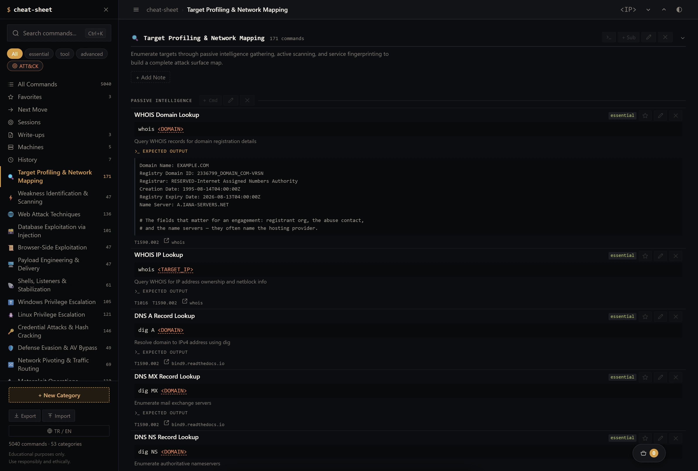
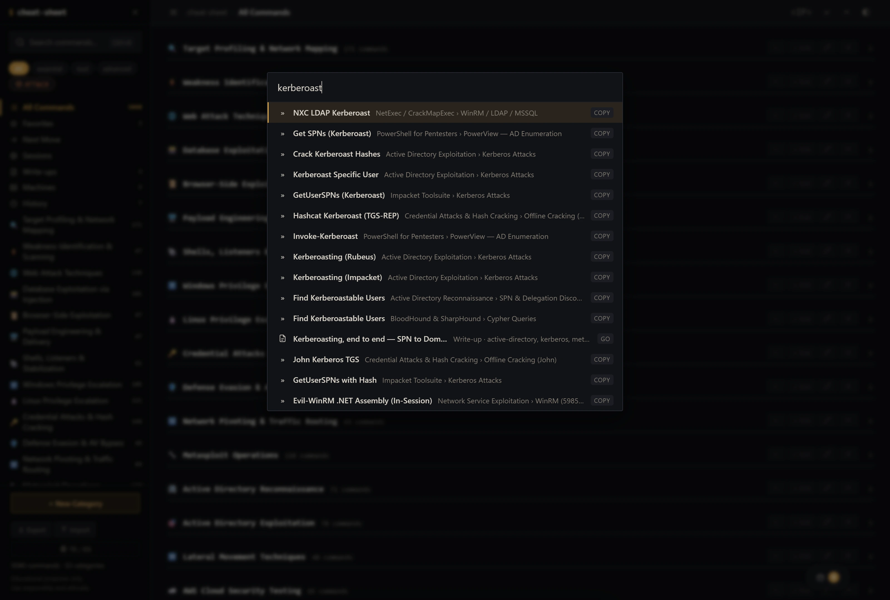
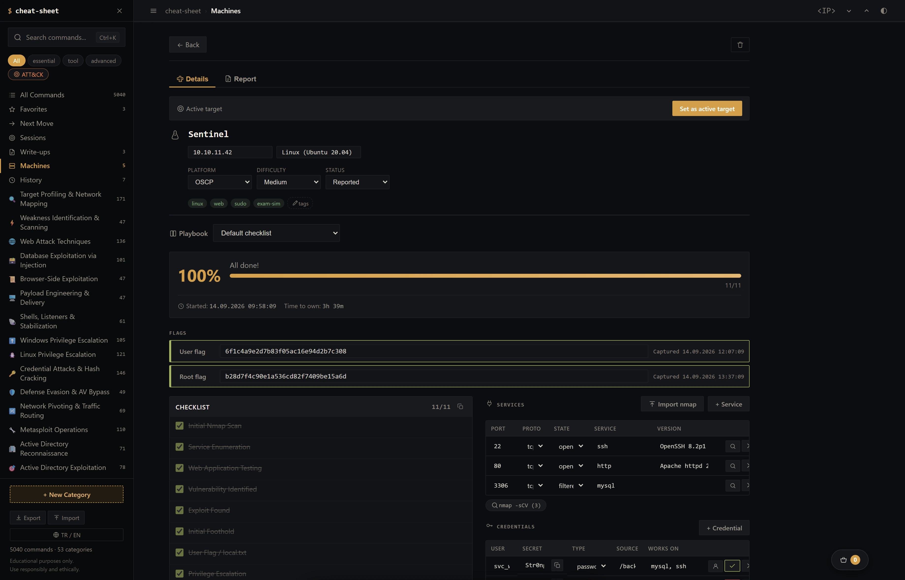
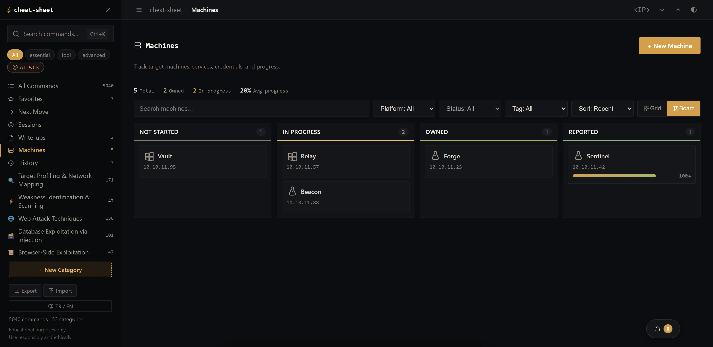
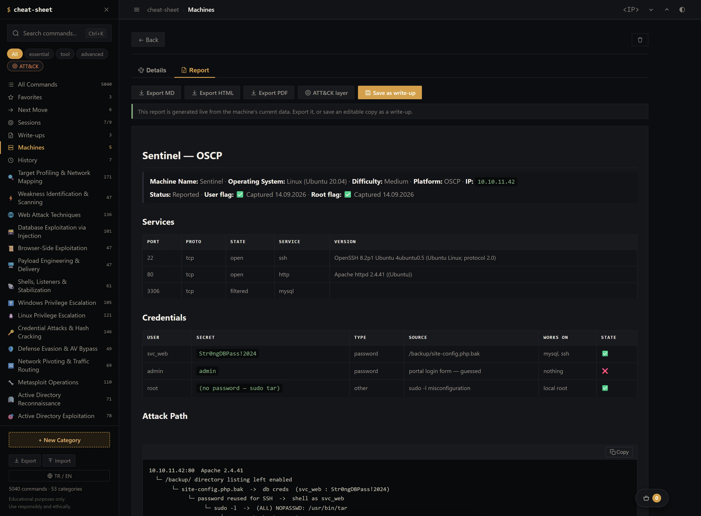
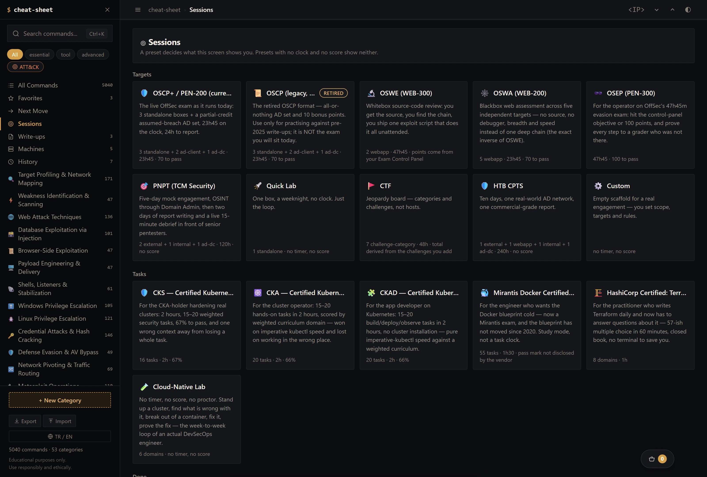
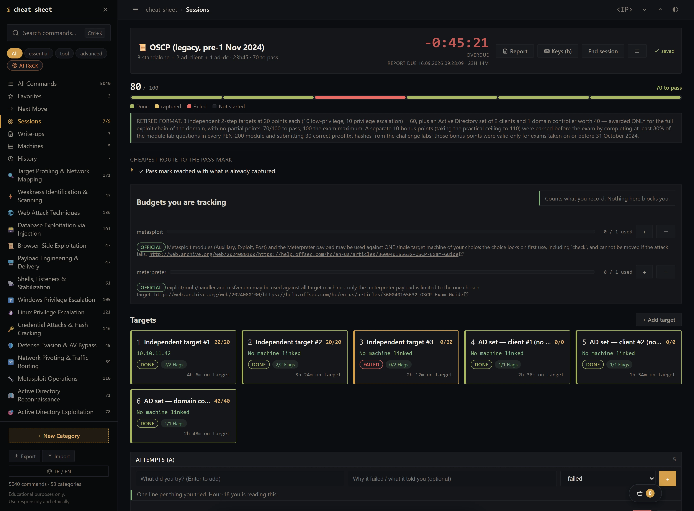
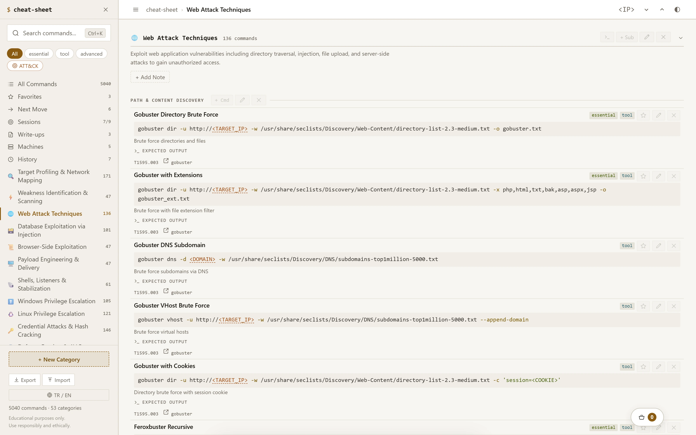
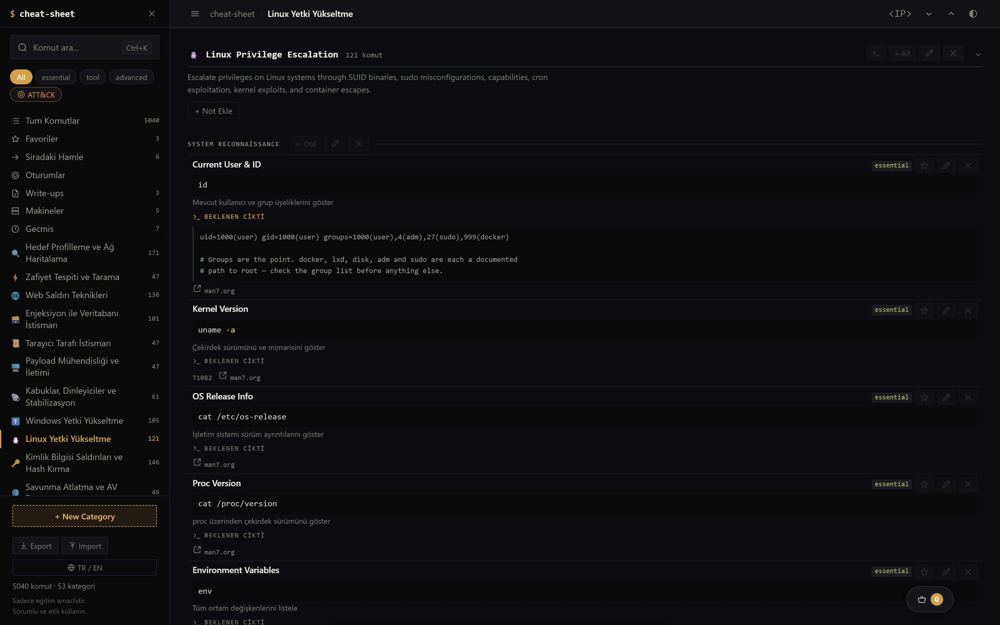
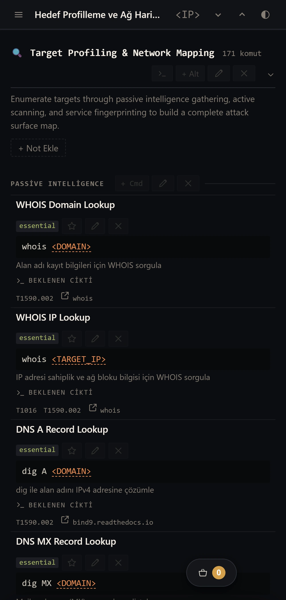

<div align="center">

# 🛡️ Offensive Security & DevSecOps Cheat Sheet

### ▶ **[Try it live — halilibrahimd27.github.io/cheat-sheet](https://halilibrahimd27.github.io/cheat-sheet/)**

*No install, no sign-up. The live build is the full app running in your browser, storing everything in IndexedDB.*

OSCP+ · OSWE · OSEP · OSDA · OSWA · PNPT · CPTS · HTB CPTS  ·  Docker · Kubernetes · Terraform · CI/CD

[](https://github.com/halilibrahimd27/cheat-sheet/stargazers)
[](https://github.com/halilibrahimd27/cheat-sheet/network/members)
[](LICENSE)
[](#docker-recommended)
<!-- STATS:BADGES -->
[](#categories)
[](#categories)
[](#categories)
<!-- /STATS:BADGES -->

> **⭐ If this saved you time, please leave a star.** It's the simplest way to support this work.

</div>

---

> ### ⚖️ Authorised use only
>
> This repository distributes thousands of offensive commands. Run them **only** against
> systems you own or have **explicit written permission** to test — your own lab, CTF and
> HTB/THM boxes, and certification exam targets. Unauthorised access to a computer system
> is a criminal offence in most jurisdictions, and you alone are responsible for what you
> execute. The full scope statement, including what counts as in-scope use and how to
> report a problem, is in **[SECURITY.md](SECURITY.md)**.

---

<!-- STATS:START -->
**5040 commands** across **53 categories** and **320 subcategories**, with **1465 MITRE ATT&CK technique tags** — bilingual interface (English + Türkçe).
<!-- STATS:END -->

## Despite the name, this is not a cheat sheet

It is a **single-user, local-first pentest workbench**. The commands are its content
layer, not its product — the product is the loop you run a box through:

1. **Set an active target.** Create a box in **Machines** — name, IP, OS, difficulty, platform.
2. **Work it.** Every command you copy anywhere in the app is logged to that box's timeline, with a timestamp. No note-taking discipline required.
3. **Paste your scan.** Drop raw `nmap -sCV` output in and it parses into a structured services table you can act on.
4. **Bank what you find.** Credentials into a per-box vault, screenshots into evidence, progress into a checklist driven by one of 12 situation-aware playbooks.
5. **Generate the report.** The Report tab is assembled from the box's current data and exports to Markdown / HTML / PDF — or lands in the write-up editor for polish.

Everything else exists to make step 2 fast and correct.

> **Runs 100% locally.** No account, no telemetry, no cloud, no analytics; the page makes
> no third-party requests. Your data never leaves your machine. The only outbound traffic
> is a link **you** click.

**Prefer to see it rather than read about it?** [`examples/`](examples/) holds one fictional
lab box and one OSCP sitting taken all the way round that loop, as a file you can import
and click through. Both reports in there are generated by the same code the app runs, and
the test suite regenerates them on every run — so the example cannot quietly go stale.

---

## The command reference

53 categories, instant search, and a copy button on everything. Each command carries a
description in English and Turkish, a tag (`essential` / `tool` / `advanced`), and —
where one exists — a MITRE ATT&CK technique chip and a link to the tool's own docs.

<p align="center">
  
</p>

**Every one of the 5040 commands ships an expected-output sample** — what the command
prints when it works, annotated with the part that actually matters. It is collapsed by
default and one click away, because "did this work?" is the question a reference usually
leaves you to answer alone.

**`Ctrl+K` opens a ranked search across everything** — every command, every category, and
each individual machine and write-up you have created, plus jump-to actions.

<p align="center">
  
</p>

Also here: a multi-select tag filter, favourites that survive reordering, per-category
sticky notes, a **placeholder fill bar** with saved profiles per target, and a **script
basket** that collects commands from anywhere into one runnable `.sh`.

---

## Machines — the box-solving workspace

One screen per target: metadata, flags, time-to-own, a checklist from one of 12
playbooks, a services table, a credential vault, an activity timeline and evidence.

<p align="center">
  
</p>

- **One-click nmap import** — paste `-sCV` output, get structured rows.
- **The vault** is structured: username, secret, type, where it came from, what it works on, and whether it is still valid. ([It is stored in plaintext](#the-credential-vault-is-stored-in-plaintext) — read that before you put anything real in it.)
- **The timeline auto-logs** every command you copy while the box is the active target.
- **An AD engagement mode** attaches hosts to a draggable node-link schematic with progress rings and per-host checklists.

A dashboard with search, filter and sort sits over the top of them — or a **Kanban board**
you can drag cards across.

<p align="center">
  
</p>

### The report writes itself

The Report tab is not a template you fill in — it is built from what the box currently
holds, and it changes as you work.

<p align="center">
  
</p>

Export it as Markdown, HTML or PDF, push it into the write-up editor, or emit the boxes
you actually touched as a **MITRE ATT&CK Navigator layer**.

---

## Sessions — a preset decides what the screen shows

**Sessions** wraps one piece of work — a lab box, a CTF, a certification attempt — from
first scan to finished report. Open it at `#session`, or press `g` then `e`.

<p align="center">
  
</p>

**16 presets in two shapes** — 10 target-based (the unit of work is a machine and a flag)
and 6 task-based (a discrete task in a proctored terminal, scored by weighted curriculum
domain across 36 domains). Behind them: **965 methodology steps** across 114 phases,
**219 service-enumeration commands** covering **38 services**, and **319 "I'm stuck" hints**.

**Every piece of cockpit furniture is gated on the preset, not on a setting.** Quick Lab
has no timer and no score — solving one box on a weeknight should not open an exam
cockpit. OSCP+ gets the clock, the live score, and the cheapest remaining route to the
pass mark. CKA/CKS/CKAD get per-task budgets and a context-confirmation gate, because
working in the wrong cluster is the most common avoidable failure on those exams.

<p align="center">
  
</p>

### Honesty is a feature

- **All 158 ground rules carry provenance** — 148 `official`, 10 `inferred` — and the two render differently.
- Where a vendor does not publish a number, the app says so rather than inventing one: OSWE's point split, DCA's pass mark and Terraform's domain weights are all shown as undisclosed.
- **Tool restrictions are advisory and never block.** A warning that fires on a permitted tool teaches people to ignore warnings, and then the one that mattered gets ignored too.
- Each preset ships a **"what was not verified" list** (72 entries) and **links its sources** (89 links).

> Exam formats change. Treat this as a study aid and confirm anything load-bearing against
> your own current exam guide.

It **reuses the Machines workspace instead of forking it**: link a target to a machine and
the enumeration queue builds itself from that machine's services table, copied commands
land in its timeline, and the vault and evidence you already have are what the report is
assembled from. Its ~594 KB corpus is fetched **on demand**, never on first paint.

---

## Next Move — describe the situation, get ranked commands

Tell it what you have — the target, the OS, what access you hold, which ports are open —
and it ranks what to try next out of the whole corpus, with your values already
substituted in.

<p align="center">
  
</p>

It pulls the situation straight from the active machine, so an `nmap` import you did an
hour ago is what it reasons about. When it has nothing specific, it falls back to
**319 diagnostic questions** — "did you actually scan all 65535 ports, or stop at the
default top-1000?" — rather than a shrug.

---

## Write-ups — a split editor that knows about your boxes

<p align="center">
  
</p>

- **8 report templates** (OSCP exam, HTB/CTF, pentest, bug bounty, OSWE, red team, disclosure, retest) and **13 insertable sections** — findings table, CVSS scale, attack narrative, ATT&CK map, remediation matrix, tooling, timeline, scope/RoE, evidence, references.
- An **offline CVSS 3.1 calculator** that inserts the score, severity and vector.
- A **linked machine** that auto-fills target placeholders.
- Image paste and drag-and-drop, and **MD / HTML / PDF export** where both HTML *and* Markdown are fully self-contained (images inlined as data URIs).

---

<details>
<summary><b>More screenshots — light theme, Türkçe, phone width</b></summary>

<br>

<p align="center">
  
</p>

<p align="center">
  
</p>

<p align="center">
  
</p>

</details>

---

## Everything else it does

- **Full CRUD** — add, edit and delete your own categories, subcategories and commands.
- **Command history** — every copy is logged locally with a timestamp, for reporting and quick re-copy.
- **Deep links & PWA** — bookmarkable views (`#machines`, `#cat/<id>`), installable, works offline.
- **Runs with or without a server** — the full app also builds to a static, server-less bundle backed by IndexedDB ([Static build](#static-build-github-pages--no-server)).
- **Export / import** your whole database as JSON; a content validator keeps the seed structurally sound, wired into CI.
- **Self-hosted assets** — no web fonts, no CDNs, no third-party scripts. It renders identically on an air-gapped or VPN-only exam VM.
- **Accessible** — skip link, a focus trap that restores focus on close, `aria-live` announcements, `prefers-reduced-motion` honoured in both CSS and JS, 24×24 minimum touch targets, and contrast tuned in both themes.
- **Docker ready & hardened** — single-command deploy, non-root, healthcheck, binds to `127.0.0.1`, optional Basic Auth, magic-byte-validated uploads.

### Keyboard shortcuts

`Ctrl+K` command palette · `Ctrl+I` quick IP changer · `?` shortcuts · `j`/`k` navigate ·
`Enter` copy focused · `g` then `h`/`f`/`w`/`m`/`e` for Home / Favorites / Write-ups /
Machines / Sessions · in the write-up editor `Ctrl+B` / `Ctrl+I` / `Ctrl+K` for bold /
italic / link.

### Placeholder convention

Commands never contain a real IP. Fill these once in the fill bar and they apply everywhere.

| Placeholder | Meaning |
|------------|---------|
| `<TARGET_IP>` | Target machine IP |
| `<ATTACKER_IP>` / `<LHOST>` | Your attack machine IP |
| `<DOMAIN>` | Target domain name |
| `<PORT>` / `<LPORT>` | Port number |
| `<USERNAME>` / `<USER>` | Username |
| `<PASSWORD>` / `<PASS>` | Password |
| `<NETWORK>/<CIDR>` | Network range (e.g. 192.168.1.0/24) |
| `<TARGET_URL>` | Full target URL |
| `<DC_IP>` | Domain Controller IP |

---

## Quick Start

### Docker (recommended)

```bash
git clone https://github.com/halilibrahimd27/cheat-sheet.git
cd cheat-sheet
docker compose up -d
```

Open **http://localhost:8899**.

> The container publishes only to `127.0.0.1:8899` by default and persists data in a Docker volume — your custom commands survive restarts and updates.

### Without Docker

```bash
git clone https://github.com/halilibrahimd27/cheat-sheet.git
cd cheat-sheet
npm install
npm start
```

Open **http://localhost:3000**.

> The server binds to `127.0.0.1` by default. See [Configuration](#configuration) to expose it on your network safely.

### Static build (GitHub Pages — no server)

The whole app can run with **no backend at all**: an in-browser adapter
([`public/local-backend.js`](public/local-backend.js)) mirrors the REST API against
**IndexedDB**, so your data still persists locally. This is what makes it publishable to
GitHub Pages, and it is what the [live demo](https://halilibrahimd27.github.io/cheat-sheet/) runs.

```bash
npm run build:static     # emits a self-contained ./docs folder
```

Commit the regenerated `docs/` and push to `main`. This repo ships
[`.github/workflows/deploy-pages.yml`](.github/workflows/deploy-pages.yml), which rebuilds
`docs/` from the commit being deployed, uploads it as a Pages artifact and publishes it —
so in your fork set **Settings → Pages → Source: GitHub Actions** (not "Deploy from a
branch"). It runs on any push to `main` touching `docs/**`, `public/**`, `seed.js` or the
build script, and can also be started by hand from the **Actions** tab. CI separately
fails if the committed `docs/` has drifted from `public/` + `seed.js`.

Your cheat sheet is then live at `https://<user>.github.io/<repo>/`.

> The static build bundles the seed into `docs/seed-data.js`, uses relative paths (works
> under a project subpath), and stores everything — categories, notes, write-ups, machines,
> uploaded screenshots as inline data URIs — in IndexedDB. Export/Import still work.

### Update to the latest commands

Pulling new code does **not** touch your database — your data lives in `data/` (or a
Docker volume), and the seed is only used the first time the app starts. To merge newly
shipped commands into an existing database:

```bash
curl -s http://localhost:8899/api/seed-status            # where you stand
curl -s -X POST 'http://localhost:8899/api/update?dryRun=1'   # preview, writes nothing
curl -s -X POST http://localhost:8899/api/update              # apply
```

`POST /api/update` is **non-destructive**: it adds what is new in the seed and leaves your
own edits, additions and deletions alone.

**Docker:** the image bakes `seed.js` in at build time, so `git pull` alone is not enough —
rebuild first:

```bash
git pull
docker compose up -d --build
curl -s -X POST 'http://127.0.0.1:8899/api/update?dryRun=1'
curl -s -X POST http://127.0.0.1:8899/api/update
```

Your `cheat-sheet-data` volume is untouched by the rebuild.

> `POST /api/reset` also exists and restores the pristine seed — it **discards everything
> you have added or changed**. Prefer `/api/update`, and export a backup first.

---

## Configuration

All configuration is via environment variables (a `.env` is **not** auto-loaded — pass them inline or via your process manager / Docker):

| Variable | Default | Description |
|----------|---------|-------------|
| `PORT` | `3000` | Port to listen on |
| `HOST` | `127.0.0.1` | Bind address. Set to `0.0.0.0` to expose on your network (the Docker image does this; the port mapping is the boundary there). |
| `DATA_DIR` | `./data` | Where the JSON database, notes, write-ups, machines and uploads are written. Point it at a volume or another disk to relocate your data; the test suite uses it to run against a throwaway directory. |
| `AUTH_USER` | `admin` | Basic Auth username (only used when `AUTH_PASS` is set) |
| `AUTH_PASS` | *(unset)* | When set, **all** requests require HTTP Basic Auth. The browser prompts once and the SPA keeps working. |
| `ALLOWED_HOSTS` | *(unset)* | Extra `Host` header values to accept. The DNS-rebinding guard is **always on** and already accepts the loopback names and any bare IP literal, so a local run or a LAN IP needs nothing here. Set it when the app is reached by a *name* — a machine hostname, or a reverse proxy's domain. Any other `Host` gets `403`. |
| `JSON_LIMIT` | `12mb` | Max request body size (covers image uploads + full DB import) |

See [`.env.example`](.env.example) for a copy-paste template.

## Security

This is a **local-first, single-user** tool. Defaults are chosen so it is safe out of the box:

- **Binds to `127.0.0.1`** — not reachable from your network unless you explicitly set `HOST=0.0.0.0`.
- **Origin / Host guard** — a cross-site `POST` cannot reach the API, and a rebound DNS name is rejected before it reaches a route. Both are on in every configuration, Docker included.
- **Optional HTTP Basic Auth** — set `AUTH_PASS` before exposing it anywhere beyond localhost, with a per-IP delay once an address starts guessing. If you bind to `0.0.0.0` without a password, the server warns.
- **Hardened uploads** — validated by **magic bytes** (not the filename), capped at 5 MB, served with `nosniff` and a restrictive CSP. SVG is rejected: it can carry script.
- **Escaping at render, validation at the boundary, CSP as backstop** — user-supplied text is HTML-escaped or written via `textContent`; `/api/import` structurally validates a payload before it touches your data; and the app ships a CSP with `script-src 'self'` — no inline scripts, no CDNs — so an escaping bug that slips through has no easy path to executing script. Markdown rendering in write-ups is the widest remaining surface and the first place to look if you find a problem.
- **Atomic writes** — JSON is written to a temp file, `fsync`'d, then renamed over the target, with a `.bak` fallback, so a crash mid-write cannot truncate your database.
- **No third-party requests** — no web fonts, CDNs, analytics or telemetry. Outbound traffic happens only when you click an ATT&CK chip or a reference link.

### The credential vault is stored in plaintext

The per-machine credential vault is a convenience feature, **not a password manager**.
Secrets you put in it are stored **unencrypted**:

- **Server build:** as plain JSON in `DATA_DIR/machines.json` on disk.
- **Static / GitHub Pages build:** as plain records in the browser's **IndexedDB**, readable by anything with access to that browser profile.
- **Exports:** `GET /api/export` and the Export button include every vault entry **verbatim**, and so does a machine's generated report.

In practice: on a **shared machine**, anyone who can read your home directory, your Docker
volume or your browser profile can read the vault — treat it as a text file of passwords.
On a **published Pages origin** the data stays in each visitor's own browser, but it lives
on a public origin, so any XSS there can read it. **Never commit an export**, and never
paste one into an issue or a published write-up.

Use it for lab, CTF and exam boxes. For real engagements, keep credentials in your team's
actual secret store.

---

## API Endpoints

| Method | Endpoint | Description |
|--------|----------|-------------|
| `GET` | `/api/health` | Liveness probe (used by the Docker HEALTHCHECK) |
| `GET` | `/api/categories` | List all categories |
| `POST` | `/api/categories` | Create a category |
| `POST` | `/api/categories/reorder` | Reorder categories by id list |
| `PUT` | `/api/categories/:id` | Update a category |
| `DELETE` | `/api/categories/:id` | Delete a category |
| `POST` | `/api/categories/:id/subcategories` | Add subcategory |
| `PUT` | `/api/categories/:id/subcategories/:subIdx` | Update subcategory |
| `DELETE` | `/api/categories/:id/subcategories/:subIdx` | Delete subcategory |
| `POST` | `.../subcategories/:subIdx/commands` | Add command |
| `PUT` | `.../commands/:cmdIdx` | Update command |
| `DELETE` | `.../commands/:cmdIdx` | Delete command |
| `GET` | `/api/notes` | All per-category notes, keyed by category id |
| `GET` | `/api/notes/:catId` | Notes for one category |
| `POST`/`PUT`/`DELETE` | `/api/notes/:catId/:noteId?` | Create / update / delete a note |
| `GET` | `/api/writeups` | List write-ups |
| `POST`/`PUT`/`DELETE` | `/api/writeups/:id?` | Create / update / delete a write-up |
| `GET` | `/api/machines` | List machines |
| `POST`/`PUT`/`DELETE` | `/api/machines/:id?` | Create / update / delete a machine |
| `POST` | `/api/upload` | Upload a write-up image (base64, magic-byte validated) |
| `GET` | `/api/export` | Download full backup (JSON) |
| `POST` | `/api/import` | Import from JSON (validated) |
| `GET` | `/api/seed-status` | Whether the bundled seed is newer than the one your database was built from |
| `POST` | `/api/update` | Non-destructive merge of new seed content; `?dryRun=1` previews without writing |
| `POST` | `/api/reset` | **Destructive** — restore the pristine seed, discarding your changes |
| `GET`/`PUT` | `/api/exam` | Read / replace the Sessions state document — see [Sessions](#sessions--a-preset-decides-what-the-screen-shows) |

## Tech stack

- **Frontend**: vanilla HTML/CSS/JS — no framework, no build step
- **Backend**: Node.js + Express — one runtime dependency, and gzip, auth and rate limiting are hand-rolled on the standard library rather than added as four more
- **Storage**: JSON files with atomic writes; IndexedDB in the static build
- **Fonts**: system font stacks — nothing is fetched from the network

## Categories

<!-- CATEGORIES:START -->
<!-- This table is generated from seed.js by scripts/update-readme.js — do not edit by hand. -->
| # | Category | Commands | Description |
|---|----------|----------|-------------|
| 1 | 🔍 Target Profiling & Network Mapping | 171 | Enumerate targets through passive intelligence gathering, active scanning, and service… |
| 2 | ⚡ Weakness Identification & Scanning | 47 | Identify known vulnerabilities and misconfigurations across network services and web ap… |
| 3 | 🌐 Web Attack Techniques | 136 | Exploit web application vulnerabilities including directory traversal, injection, file… |
| 4 | 🗃️ Database Exploitation via Injection | 101 | Detect and exploit SQL injection vulnerabilities to extract data, escalate privileges,… |
| 5 | 📜 Browser-Side Exploitation | 47 | Exploit cross-site scripting, cross-site request forgery, and DOM-based vulnerabilities… |
| 6 | 🖥️ Payload Engineering & Delivery | 47 | Generate reverse shells, bind shells, web shells, and custom payloads for various platf… |
| 7 | 🐚 Shells, Listeners & Stabilization | 61 | Establish reverse shells, bind shells, and web shells across platforms, then upgrade to… |
| 8 | ⬆️ Windows Privilege Escalation | 105 | Escalate privileges on Windows hosts through service misconfigurations, token abuse, cr… |
| 9 | 🐧 Linux Privilege Escalation | 121 | Escalate privileges on Linux systems through SUID binaries, sudo misconfigurations, cap… |
| 10 | 🔑 Credential Attacks & Hash Cracking | 146 | Perform online brute force, offline hash cracking, credential dumping, and password spr… |
| 11 | 🛡️ Defense Evasion & AV Bypass | 49 | Bypass antivirus, AMSI, AppLocker, Constrained Language Mode, and other security contro… |
| 12 | 🔀 Network Pivoting & Traffic Routing | 69 | Route traffic through compromised hosts to reach internal networks using SSH tunnels, S… |
| 13 | 🔧 Metasploit Operations | 110 | Metasploit Framework for exploitation, post-exploitation, and pivoting |
| 14 | 🏢 Active Directory Reconnaissance | 71 | Enumerate Active Directory domains, users, groups, trusts, and attack paths |
| 15 | 🎯 Active Directory Exploitation | 78 | Attack Active Directory with Kerberos, NTLM relay, delegation, and persistence techniques |
| 16 | ↔️ Lateral Movement Techniques | 48 | Move laterally across the network using remote execution and Windows protocols |
| 17 | ☁️ AWS Cloud Security Testing | 65 | Enumerate and exploit AWS cloud services, IAM, S3, EC2, and more |
| 18 | 📁 File Transfer Arsenal | 53 | Techniques for transferring files to and from targets across different protocols |
| 19 | 🔐 Protocol Tunneling & Firewall Evasion | 29 | Bypass firewalls and deep packet inspection using protocol tunneling techniques |
| 20 | 🎣 Social Engineering & Phishing | 34 | Phishing infrastructure, credential harvesting, and social engineering tools |
| 21 | 💣 Exploit Research & Development | 44 | Find, adapt, compile, and develop exploits for penetration testing |
| 22 | 🧩 Engagement Methodology & Playbook | 73 | Structured pentest workflow, service checklists, and engagement methodology |
| 23 | 🐳 Container & Infrastructure Testing | 78 | Test Docker, Kubernetes, and CI/CD pipeline security |
| 24 | 🕸️ NetExec / CrackMapExec | 80 | NetExec (nxc) and CrackMapExec for Active Directory enumeration, lateral movement, and… |
| 25 | 🐕 BloodHound & SharpHound | 39 | BloodHound AD attack path analysis, SharpHound collection, and useful Cypher queries fo… |
| 26 | 📜 ADCS — Certificate Services Attacks | 22 | Active Directory Certificate Services exploitation — ESC1 through ESC8 using Certipy, C… |
| 27 | 🔌 Network Service Exploitation | 127 | Service-specific exploitation techniques for common ports found during OSCP-style engag… |
| 28 | ⚡ PowerShell for Pentesters | 51 | PowerShell commands for Active Directory enumeration, exploitation, and post-exploitati… |
| 29 | 🐍 Impacket Toolsuite | 34 | Comprehensive Impacket tools for Windows/AD protocol attacks, credential dumping, and l… |
| 30 | 🐱 Mimikatz Commands | 25 | Mimikatz credential extraction, Kerberos ticket manipulation, and Windows credential at… |
| 31 | 🪟 Windows Post-Exploitation | 55 | Windows post-exploitation — situational awareness, persistence, data gathering, and pri… |
| 32 | 🐧 Linux Post-Exploitation | 35 | Linux post-exploitation — situational awareness, credential hunting, persistence, and l… |
| 33 | 📡 Wireless Security Testing | 19 | WiFi security testing — WPA/WPA2 cracking, WPS attacks, evil twin, and wireless reconna… |
| 34 | 🔶 Burp Suite | 41 | Burp Suite web application security testing — proxy setup, scanning, intruder attacks,… |
| 35 | 💉 MSFVenom Payload Reference | 28 | Comprehensive msfvenom payload generation for various platforms, formats, and encoders. |
| 36 | 🐳 Docker — Engine & CLI | 224 | Day-to-day Docker operations: image build/manage, container lifecycle, volumes, network… |
| 37 | 🛡️ Docker Security | 220 | Securing Docker: image scanning, Dockerfile hardening, runtime security, secrets, rootl… |
| 38 | ☸️ Kubernetes — kubectl Operations | 222 | Operating Kubernetes with kubectl: workloads, services, config, debugging, contexts, an… |
| 39 | 🔐 Kubernetes Security | 215 | Securing and attacking Kubernetes: RBAC, Pod Security, network policies, admission cont… |
| 40 | 🏗️ Terraform / IaC Core | 190 | Terraform workflow: init, plan, apply, state management, workspaces, modules, providers… |
| 41 | 🔎 IaC Security Scanning | 190 | Static analysis and policy enforcement for infrastructure-as-code: Terraform, CloudForm… |
| 42 | ⚙️ Ansible Automation | 189 | Ansible for configuration management and automation: ad-hoc commands, playbooks, invent… |
| 43 | 🔁 CI/CD Pipeline Security | 192 | Securing CI/CD pipelines: GitHub Actions / GitLab CI hardening, secrets scanning, SAST/… |
| 44 | ⛓️ Software Supply Chain Security | 136 | Supply chain integrity: SBOM generation, artifact signing, provenance/attestation, and… |
| 45 | 🗝️ Secrets Management | 139 | Managing and protecting secrets: HashiCorp Vault, SOPS, sealed-secrets, cloud secret ma… |
| 46 | 🦅 Cloud-Native Runtime Security | 137 | Runtime threat detection and enforcement for containers and hosts using eBPF-based and… |
| 47 | 🌩️ Cloud Security Posture (Multi-Cloud) | 197 | Auditing cloud posture across AWS, Azure, and GCP with CSPM and IAM tooling. |
| 48 | ⎈ Helm & Package Management | 110 | Helm chart operations and security: install, upgrade, templating, repositories, and cha… |
| 49 | 🔗 Service Mesh & Network Security | 108 | Service mesh operations and zero-trust networking: Istio, Linkerd, Cilium, and mTLS. |
| 50 | 📊 Observability & Detection Engineering | 136 | Security observability and detection: log pipelines, SIEM queries, and detection-as-cod… |
| 51 | 📱 Mobile Application Security | 40 | Android and iOS application security testing: static reversing, dynamic instrumentation… |
| 52 | 🤖 LLM / AI Security | 32 | Testing LLM-powered applications: prompt injection and jailbreaks, automated red-team s… |
| 53 | 🟣 Purple Team & Detection Validation | 24 | Adversary emulation and detection validation: Atomic Red Team, MITRE Caldera, ATT&CK ma… |
<!-- CATEGORIES:END -->

## Project structure

```
cheat-sheet/
├── server.js               # Express REST API (exports app; testable)
├── seed.js                 # Default commands (seed data)
├── package.json            # Scripts + the single runtime dependency
├── eslint.config.js        # Flat ESLint config (npm run lint)
├── Dockerfile              # Container build (non-root, healthcheck)
├── docker-compose.yml      # Docker orchestration
├── .env.example            # Configuration template
├── .gitattributes          # Line-ending normalisation (keeps the static build reproducible)
├── CONTRIBUTING.md         # How to add commands and how to work on the app
├── SECURITY.md             # Scope statement + vulnerability reporting
├── .github/
│   ├── workflows/
│   │   ├── ci.yml              # Lint, test, content + dependency audit, README/docs drift gates
│   │   ├── codeql.yml          # CodeQL static analysis
│   │   └── deploy-pages.yml    # Rebuild docs/ and publish it to GitHub Pages
│   ├── ISSUE_TEMPLATE/         # Bug, correction, command, feature, workspace/Sessions
│   ├── PULL_REQUEST_TEMPLATE.md
│   ├── dependabot.yml
│   ├── CODEOWNERS
│   └── FUNDING.yml
├── scripts/
│   ├── update-readme.js    # Regenerate stats + category table from seed.js
│   ├── validate-content.js # Seed structure/quality validator (runs in CI)
│   ├── build-static.js     # Emit ./docs — a server-less build for GitHub Pages
│   ├── screenshots.js      # Re-shoot assets/*.png by driving the real app in headless Chrome
│   ├── demo-fixture.js     # The lived-in demo database those screenshots are taken of
│   ├── tag-attack.js       # Map offensive commands → MITRE ATT&CK ids (idempotent)
│   ├── merge-category.js   # Merge a category JSON into seed.js
│   ├── fix-translations.js # One-off: fill in missing Turkish descriptions
│   ├── fix-turklish.js     # One-off: repair botched auto-translated desc_tr strings
│   └── turklish-detect.js  # Shared garbled-Turkish detector (used by the content validator)
├── test/                   # node:test suites (no test framework)
│   ├── session.test.js     # Sessions: preset data integrity + view rendering
│   ├── icons.test.js       # The sprite: every icon reference resolves, no glyph creeps back
│   ├── references.test.js  # Command reference links: https-only, real docs, coverage ratchet
│   ├── examples.test.js    # Regenerates examples/ and fails if it drifted
│   ├── touch-targets.test.js  # Every icon-only control is at least 24x24 (WCAG 2.5.8)
│   ├── scripts.test.js     # validate-content / fix-turklish / build-static, run as processes
│   └── helpers/            # DOM/IndexedDB/server harnesses shared by the suites
├── public/
│   ├── index.html          # Main HTML (CSP meta, no inline script, one icon sprite)
│   ├── style.css           # Dark/Light theme styles
│   ├── app.js              # Frontend logic + CRUD
│   ├── session.js          # Sessions view (optional script; app.js works without it)
│   ├── session-data.js     # Session presets, service probes, stuck hints (~594 KB, on demand)
│   ├── nextmove.js         # Next Move ranking
│   ├── checklist-templates.js  # The 12 machine playbooks
│   ├── local-backend.js    # In-browser IndexedDB API (static / offline build)
│   ├── manifest.json       # PWA manifest
│   └── service-worker.js   # Offline cache (stale-while-revalidate)
├── examples/               # One box solved end to end — importable, regenerated by the tests
├── assets/                 # README screenshots (regenerate: node scripts/screenshots.js)
├── docs/                   # Static build output (npm run build:static) — GitHub Pages
└── data/                   # Persistent data (auto-generated, git-ignored)
```

### The screenshots above are reproducible

They are not hand-captured. `node scripts/screenshots.js` launches headless Chrome over
the DevTools protocol — no Puppeteer, no added dependency — imports
[`scripts/demo-fixture.js`](scripts/demo-fixture.js) through the app's own `/api/import`,
drives each view the way a person would, and writes `assets/*.webp`. Re-run it after a UI
change and the README stops being a picture of a version that no longer exists.

```bash
npm run screenshots                               # shoot the live Pages build
node scripts/screenshots.js --base http://localhost:3000/
node scripts/screenshots.js --only browser,palette
```

---

## Content provenance & attribution

The command corpus was written and curated for this repository from the maintainer's own
lab and certification-prep notes, from official tool documentation and `--help` output,
and from widely published technique knowledge. It is **not** copied from
[HackTricks](https://book.hacktricks.wiki/), PayloadsAllTheThings, or any other
CC BY-NC-SA / share-alike source; where such a resource is genuinely the best explanation
of a technique, it is linked from a command's `ref` field rather than reproduced. If you
believe any entry reproduces third-party material, please
[open an issue](../../issues/new/choose) and it will be rewritten or removed.

Contributions must follow the same rule — see [CONTRIBUTING.md](CONTRIBUTING.md).

**Reference links:** 4487 of the 5040 commands (89%) carry a link to the tool's own
documentation — 4488 links across 104 hosts, every one fetched and confirmed to answer 200
before it shipped. The link is the vendor's or the project's own page, never a blog, a
shortener or an SEO aggregator. The rest are code snippets where no honest single source
exists; `node scripts/validate-content.js` ratchets that gap so it can shrink but never grow.

**ATT&CK tags** are generated by a curated, idempotent tagger (`npm run tag:attack`) that
only tags offensive commands — DevSecOps, ops and detection commands stay untagged — and
every id is verified against attack.mitre.org. There is deliberately no per-technique
facet: one filter row, one decision.

### MITRE ATT&CK®

MITRE ATT&CK® is a registered trademark of The MITRE Corporation. This project is **not**
affiliated with, endorsed by, or sponsored by MITRE. Technique identifiers (`T####`) and
technique names are used here only to reference the publicly published
[ATT&CK knowledge base](https://attack.mitre.org/) — © The MITRE Corporation — under the
[ATT&CK Terms of Use](https://attack.mitre.org/resources/legal-and-branding/terms-of-use/).
The command text, descriptions and mappings in this repository are the project's own work
and are licensed under [MIT](LICENSE).

## Disclaimer

This tool is intended for **educational purposes only**. All commands and techniques are
meant for use in authorized penetration testing, CTF competitions, and security
certification preparation. Always ensure you have proper authorization before testing any
system — see [SECURITY.md](SECURITY.md) for the full scope statement.

## Contributing

Contributions are welcome — and not only commands. Bug reports, workspace features,
accessibility fixes, translations and documentation all count. See
[CONTRIBUTING.md](CONTRIBUTING.md). In short:

1. Fork the repository and create a branch (`git checkout -b feat/your-change`)
2. Make your change — for seed content, follow the existing structure and include `desc_tr`
3. Run `npm run lint`, `npm test` and `npm run validate-content`
4. If you touched `seed.js`, run `node scripts/update-readme.js` (CI checks this)
5. Open a pull request

## License

MIT License — feel free to use, modify and distribute. See [LICENSE](LICENSE) for the full text.

---

<div align="center">

## 🌟 Support this project

| Time | How you can help |
|---|---|
| **5 seconds** | Click the **⭐ Star** button at the top |
| **30 seconds** | Share on Twitter / LinkedIn / your Discord |
| **5 minutes** | Open an [issue](../../issues/new/choose) for a missing command |
| **30 minutes** | Submit a PR with new commands or fixes |
| **2 hours** | Add a whole new category |

**Star history:**

[](https://star-history.com/#halilibrahimd27/cheat-sheet&Date)

</div>
